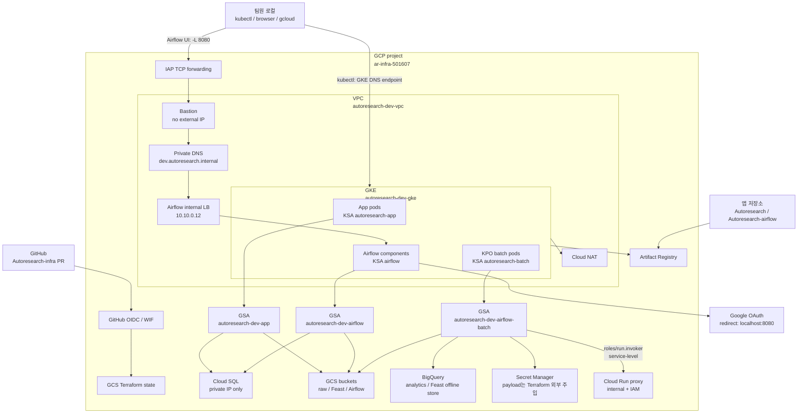
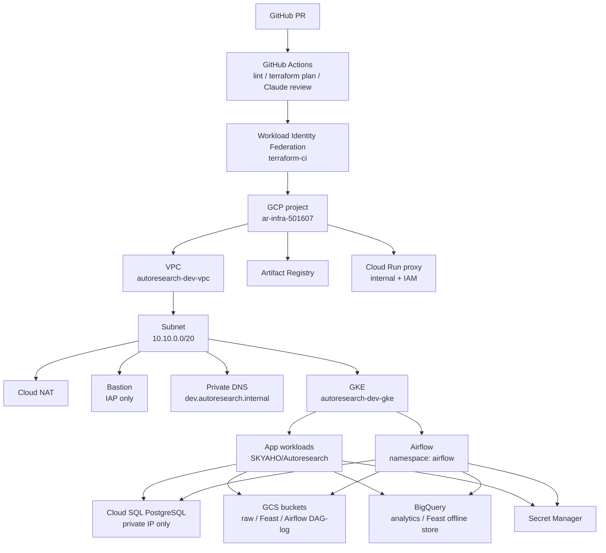
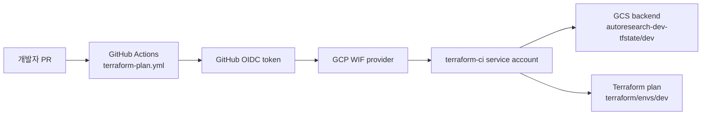
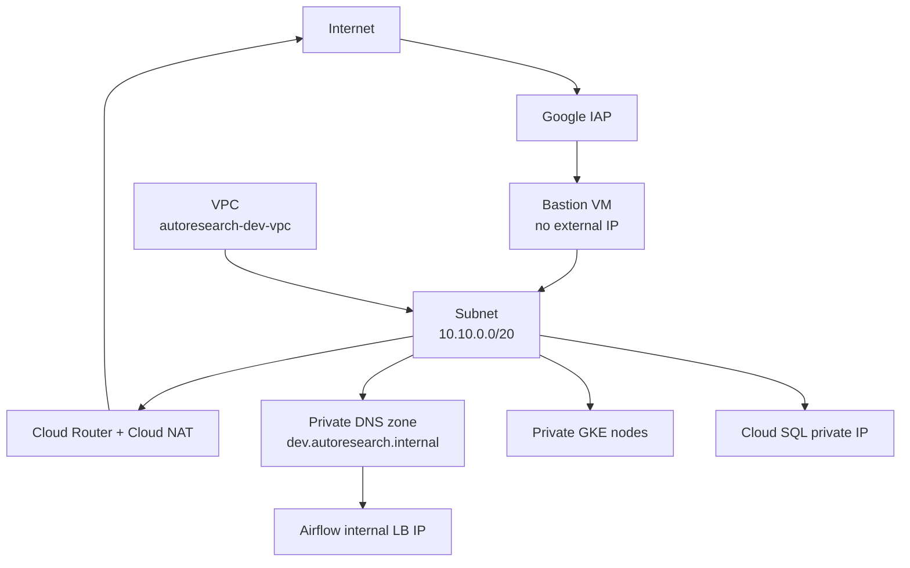
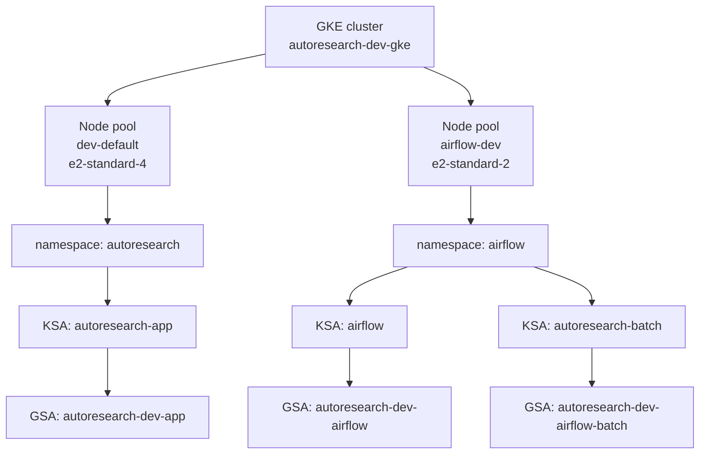
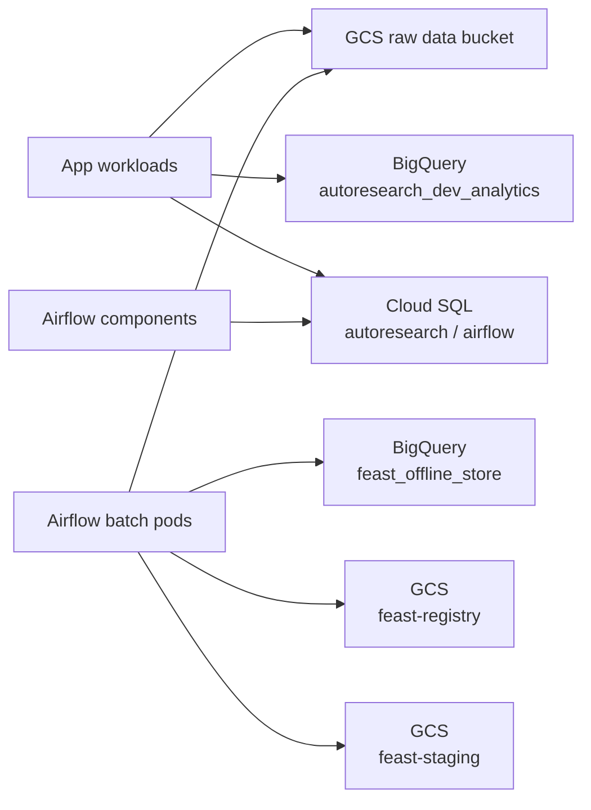
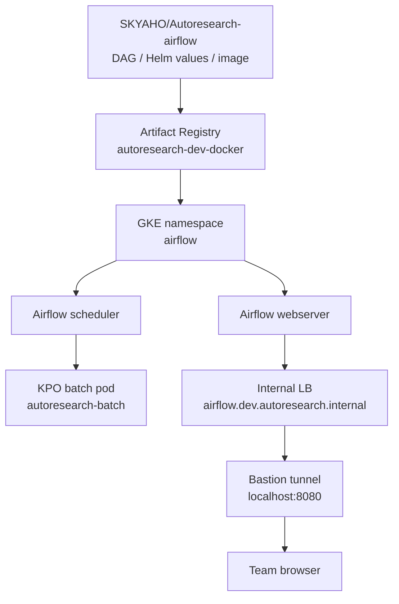
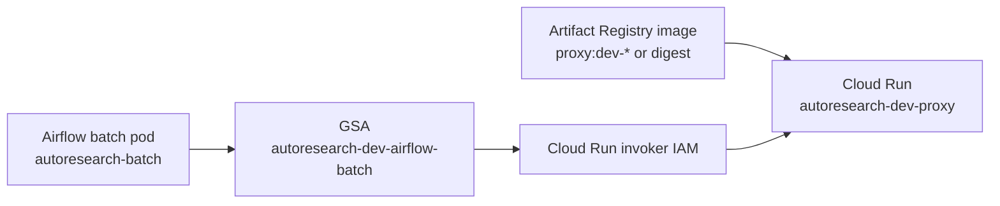
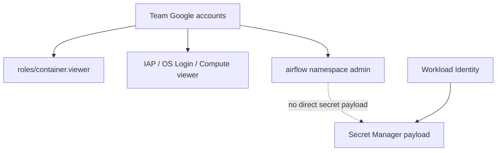

# AutoResearch dev 인프라 요약

지금까지 이 저장소에서 만든 dev 인프라의 현재 모습을 한눈에 보기 위한 문서다.
세부 변수, apply 절차, 운영 명령은 `TERRAFORM_DEV.md`와
`TEAM_OPERATIONS_RUNBOOK.md`를 우선한다.

## 기본 정보

| 항목 | 값 |
|---|---|
| GCP project | `ar-infra-501607` |
| 기본 region / zone | `asia-northeast3` / `asia-northeast3-a` |
| Terraform dev root | `terraform/envs/dev` |
| Bootstrap root | `terraform/bootstrap` |
| Kubernetes admin roots | `terraform/admin/gke-team-access`, `terraform/admin/airflow-k8s`, `terraform/admin/monitoring-k8s`, `terraform/admin/argocd-k8s` |
| 일반 애플리케이션 저장소 | `SKYAHO/Autoresearch` |
| Airflow 저장소 | `SKYAHO/Autoresearch-airflow` |

## 운영 관점 한 장 요약

아래 다이어그램은 팀원이 실제로 접속하거나, CI가 plan을 돌리거나, Airflow batch가
데이터를 적재할 때의 큰 흐름을 한 장으로 압축한 것이다. 세부 리소스 설명은 뒤의
인프라별 상세 구조를 기준으로 본다.

접근 흐름 요약:

| 구분 | 경로 | 인증/권한 |
|---|---|---|
| Airflow UI | 로컬 `gcloud compute ssh --tunnel-through-iap -L 8080:airflow.dev.autoresearch.internal:8080` → `http://localhost:8080` | IAP, OS Login, Google OAuth |
| kubectl | `gcloud container clusters get-credentials ... --dns-endpoint` | `roles/container.viewer` + GKE auth plugin |
| PR plan | GitHub Actions → OIDC/WIF → CI service account → GCS state/dev plan | service account key 없음 |
| Cloud Run proxy | Airflow batch pod → Workload Identity → batch GSA → Cloud Run ID token → proxy | `roles/run.invoker`는 필요조건. ID token, `YOUTUBE_PROXY_URL`, `X-Goog-Api-Key`, VPC 내부 경로가 함께 필요 |

## 이 문서에서 쓰는 기본 용어

새로운 용어가 나오면 아래 정의를 먼저 기준으로 읽는다. 더 구체적인 설정값은 각
인프라 섹션의 "주요 설정 상세" 표에 다시 설명한다.

| 용어 | 뜻 | 이 인프라에서의 의미 |
|---|---|---|
| Project | GCP 리소스를 담는 최상위 논리 공간 | `ar-infra-501607` 하나에 dev 인프라를 구성 |
| Region | GCP 리소스가 위치하는 지리적 권역 | `asia-northeast3` 서울 region |
| Zone | Region 안의 더 작은 가용 영역 | `asia-northeast3-a`에 zonal GKE와 Bastion 배치 |
| Terraform root | Terraform을 실행하는 기준 디렉터리 | `terraform/envs/dev`, `terraform/bootstrap`, `terraform/admin/*` |
| State | Terraform이 "내가 관리 중"이라고 기억하는 리소스 목록 | GCS backend bucket에 저장 |
| Backend | Terraform state 저장 위치 설정 | `autoresearch-dev-tfstate` GCS bucket 사용 |
| CIDR | IP 주소 범위를 표현하는 표기법 | `10.10.0.0/20`처럼 subnet 대역을 표현 |
| VPC | 클라우드 안의 사설 네트워크 | dev 리소스가 서로 통신하는 네트워크 경계 |
| Subnet | VPC 안에서 IP 대역을 나눈 구간 | `10.10.0.0/20` dev subnet |
| Private IP | 인터넷에서 직접 접근할 수 없는 내부 IP | GKE node, Cloud SQL, Airflow ILB에 사용 |
| Cloud NAT | private 리소스가 외부로 나갈 때 쓰는 NAT | GKE node가 이미지 pull/API 호출을 할 때 사용 |
| Bastion | 내부망으로 들어가기 위한 점프 서버 | IAP 터널 종단, Airflow UI 접속 경로 |
| IAP | Google 계정/IAM 기반 터널 접근 기능 | Bastion SSH를 외부 IP 없이 열기 위해 사용 |
| GKE | Google 관리형 Kubernetes | 앱과 Airflow가 실행되는 클러스터 |
| Kubernetes | 컨테이너를 여러 서버에 배포/운영하는 시스템 | GKE가 관리형 Kubernetes를 제공 |
| Pod | Kubernetes에서 컨테이너가 실행되는 최소 단위 | 앱 pod, Airflow component pod, batch pod |
| Namespace | Kubernetes 리소스를 논리적으로 나누는 공간 | Airflow는 `airflow` namespace에 격리 |
| Node pool | 같은 사양의 GKE worker node 묶음 | 일반 앱용 `dev-default`, Airflow용 `airflow-dev` |
| KSA | Kubernetes ServiceAccount | pod가 Kubernetes 안에서 쓰는 신원 |
| GSA | Google Service Account | GCP API 접근 권한을 받는 신원 |
| Workload Identity | KSA가 GSA를 가장하게 하는 GKE 기능 | JSON key 없이 pod에 GCP 권한 부여 |
| RBAC | Kubernetes 권한 제어 방식 | 팀원에게 `airflow` namespace admin 권한 부여 |
| NetworkPolicy | Kubernetes pod 간 통신을 제한하는 정책 | Airflow namespace ingress/egress 제한 |
| Ingress | 밖에서 안으로 들어오는 트래픽 | Airflow UI 8080 접근 허용 범위 |
| Egress | 안에서 밖으로 나가는 트래픽 | GKE node/Pod의 외부 API 호출 경로 |
| IAM | GCP 권한 관리 체계 | 사람/서비스 계정별 최소 권한 부여 |
| Secret Manager | 민감값 저장 서비스 | API key, OAuth secret, DB password 저장소 |
| Payload | secret의 실제 값 본문 | Terraform 밖에서 주입하고 문서/PR에 쓰지 않음 |
| Service account key | service account 장기 인증 키 파일 | 유출 위험 때문에 발급하지 않는 것이 원칙 |
| GCS | Google Cloud Storage | 원본 데이터, DAG/log, Feast registry/staging 저장 |
| BigQuery | 분석용 columnar data warehouse | 분석 dataset과 Feast offline store |
| Cloud SQL | 관리형 RDBMS | PostgreSQL 앱 DB와 Airflow metadata DB |
| Artifact Registry | 컨테이너 이미지 저장소 | 앱/Airflow/Cloud Run 이미지 저장 |
| Cloud Run | 컨테이너를 serverless로 실행하는 서비스 | dev proxy 서비스 |
| ILB | Internal Load Balancer | Airflow UI를 VPC 내부에만 노출 |
| Private DNS | VPC 내부에서만 해석되는 DNS | `airflow.dev.autoresearch.internal` |
| DNS endpoint | GKE control plane에 DNS 이름으로 접속하는 방식 | 팀원 IP 등록 없이 IAM으로 kubeconfig 발급 |
| OIDC | 짧게 발급되는 신원 토큰 표준 | GitHub Actions가 GCP에 인증할 때 사용 |
| WIF | Workload Identity Federation | GitHub OIDC를 GCP service account로 연결 |
| OAuth | 외부 계정 로그인을 위임하는 인증 표준 | Airflow Google 로그인에 사용 |
| KPO | KubernetesPodOperator | Airflow DAG에서 Kubernetes pod를 띄우는 operator |
| Proxy | 호출을 대신 받아 내부 서비스로 전달하거나 중계하는 컴포넌트 | dev Cloud Run proxy |
| Invoker | Cloud Run을 호출할 수 있는 IAM 권한 주체 | Airflow batch GSA가 dev proxy를 호출 |
| Image tag | 컨테이너 이미지 버전 이름 | `proxy:dev-YYYYMMDD-N` 같은 재배포 단위 |
| Digest | 컨테이너 이미지 내용 기반 고정 식별자 | `sha256:...` 형식, 같은 내용이면 값이 고정 |
| Metadata DB | 시스템 내부 상태를 저장하는 DB | Airflow scheduler/webserver 상태 저장 |
| Offline store | 모델 학습/과거 조회용 feature 저장소 | Feast가 BigQuery dataset을 사용 |

## 전체 구조

## 생성된 주요 리소스

| 영역 | 주요 리소스 | 목적 |
|---|---|---|
| Network | `autoresearch-dev-vpc`, `autoresearch-dev-subnet` | dev 리소스가 배치되는 사설 네트워크 |
| Egress | `autoresearch-dev-router`, `autoresearch-dev-nat` | private GKE node의 외부 API/이미지 pull egress |
| Bastion | `autoresearch-dev-bastion` | IAP 터널로 VPC 내부 서비스에 접근하는 진입점 |
| DNS / ILB | `dev.autoresearch.internal`, `airflow.dev.autoresearch.internal`, Airflow ILB 예약 IP | Airflow UI를 VPC 내부에서만 접근 |
| Artifact Registry | `autoresearch-dev-docker` | 애플리케이션/Airflow 컨테이너 이미지 저장 |
| Cloud SQL | `autoresearch-dev-pg`, DB `autoresearch`, DB `airflow` | 앱 DB와 Airflow metadata DB |
| GKE | `autoresearch-dev-gke`, node pool `dev-default`, `airflow-dev` | 앱 워크로드와 Airflow 실행 기반 |
| Cloud Run | `autoresearch-dev-proxy` | 내부 전용 proxy 서비스, invoker IAM 기반 |
| GCS | raw data bucket, Feast registry/staging bucket, Airflow DAG/log bucket | 원본 데이터, feature store 메타데이터, DAG/log 저장 |
| BigQuery | `autoresearch_dev_analytics`, `feast_offline_store` | 분석 데이터셋과 Feast offline store |
| Secret Manager | DB password, YouTube/OpenRouter API key, Airflow OAuth client secret metadata | 민감값 저장소. payload는 Terraform 밖에서 관리 |
| IAM / WI | GKE node SA, app SA, Airflow SA, Airflow batch SA, proxy SA, CI SA | 워크로드별 최소 권한과 Workload Identity |

## 인프라별 상세 구조

### 1. Terraform / CI / State

- `terraform/bootstrap`은 Terraform state bucket, GitHub OIDC용 WIF pool/provider,
  CI service account를 만든다. bootstrap은 초기 1회성 성격이 강하다.
- `terraform/envs/dev`는 실제 dev 인프라 root module이다. VPC, GKE, Cloud SQL,
  GCS, BigQuery, Cloud Run, Secret Manager, Airflow GCP 리소스가 여기 있다.
- PR이 열리면 GitHub Actions가 실제 GCP 자격 증명을 service account key 없이
  OIDC/WIF로 얻고, dev root에 대해 plan을 실행한다.
- apply는 자동화하지 않았다. 실제 리소스 생성/수정/삭제는 운영자가 로컬에서
  명시적으로 `terraform apply`를 실행한다.

주요 설정 상세:

| 설정 | 값/위치 | 설명 |
|---|---|---|
| `terraform/bootstrap` | 별도 root | state bucket, WIF, CI SA처럼 dev root를 실행하기 전에 필요한 기반을 만든다. |
| `terraform/envs/dev` | dev root | 실제 dev GCP 리소스 대부분을 관리한다. |
| `terraform/admin/gke-team-access` | 별도 state | 팀원 Google 계정 IAM을 관리한다. 사람 이메일이 일반 PR plan에 노출되지 않게 분리했다. |
| `terraform/admin/airflow-k8s` | 별도 state | Kubernetes namespace/RBAC/NetworkPolicy를 관리한다. GKE API 접근이 필요해 dev root와 분리했다. |
| `terraform/admin/monitoring-k8s` | 별도 state | Prometheus/Grafana monitoring namespace, Helm release, port-forward RBAC를 관리한다. |
| `terraform/admin/argocd-k8s` | 별도 state | ArgoCD namespace와 argo-cd Helm release를 관리한다. AppProject/Application은 #85에서 추가한다. |
| `terraform-plan.yml` | GitHub Actions | PR마다 fmt/validate/plan을 실행하고 결과를 댓글/check로 보여준다. |
| WIF/OIDC | GitHub Actions -> GCP | service account JSON key 없이 CI가 GCP 권한을 얻는다. 키 파일 유출 위험을 줄이기 위한 설정이다. |
| Apply 수동 운영 | 운영자 로컬 | plan은 자동, apply는 수동이다. 실제 비용/권한/삭제 영향이 있는 변경은 사람이 확인하고 적용한다. |

### 2. 네트워크 / NAT / Bastion / DNS

- VPC는 dev 리소스의 기본 네트워크 경계다. GKE node, Bastion, Cloud SQL private IP,
  Airflow internal LB가 이 경계 안에서 동작한다.
- GKE node에는 외부 IP가 없어서 Artifact Registry 이미지 pull, Google APIs 호출,
  외부 API 호출은 Cloud NAT를 통해 나간다.
- Bastion은 외부 IP가 없고 IAP TCP forwarding으로만 접속한다. 팀원은 Bastion을
  통해 Airflow UI 같은 VPC 내부 서비스로 터널을 연다.
- `airflow.dev.autoresearch.internal`은 private DNS zone에 있는 내부 도메인이다.
  로컬 PC에서 바로 해석되는 공개 DNS가 아니라, Bastion 터널 또는 VPC 내부에서 쓰는
  이름이다.

주요 설정 상세:

| 설정 | 값 | 설명 |
|---|---|---|
| VPC | `autoresearch-dev-vpc` | dev 인프라 전용 네트워크다. 리소스 간 내부 통신 경계를 만든다. |
| Subnet | `autoresearch-dev-subnet`, `10.10.0.0/20` | GKE node, Bastion, internal LB 등이 들어가는 IP 대역이다. |
| Private Google Access | enabled | private subnet의 VM/GKE node가 Google API에 접근할 수 있게 한다. |
| Cloud NAT | `autoresearch-dev-nat` | private node가 외부 API나 Artifact Registry에 나갈 때 공인 egress를 제공한다. |
| Bastion external IP | 없음 | 인터넷에서 VM으로 직접 SSH하지 못하게 막는다. |
| Bastion access | IAP TCP forwarding | Google 계정 + IAM으로 SSH 터널 접근을 제어한다. |
| Private DNS zone | `dev.autoresearch.internal` | VPC 내부 전용 이름 공간이다. 공개 인터넷 DNS가 아니다. |
| Airflow FQDN | `airflow.dev.autoresearch.internal` | Airflow internal LB IP를 가리키는 내부 도메인이다. |

### 3. GKE / Workload 실행 계층

- `dev-default` node pool은 일반 앱 워크로드용이다.
- `airflow-dev` node pool은 Airflow component를 분리해 배치하기 위한 전용 node
  pool이다.
- Kubernetes service account와 GCP service account는 Workload Identity로 연결한다.
  pod는 JSON key 없이 GCP 권한을 얻는다.
- `airflow/airflow`는 Airflow webserver/scheduler 등 component용이고,
  `airflow/autoresearch-batch`는 KubernetesPodOperator batch pod용이다.
- batch GSA는 YouTube/OpenRouter secret, raw data bucket, Feast registry/staging,
  BigQuery offline store에 필요한 권한만 갖는다. Cloud SQL metadata DB나 Airflow
  DAG/log bucket 권한은 Airflow component GSA가 담당한다.

주요 설정 상세:

| 설정 | 값 | 설명 |
|---|---|---|
| Cluster | `autoresearch-dev-gke` | 앱과 Airflow를 실행하는 Kubernetes 클러스터다. |
| Cluster type | Standard zonal | node pool과 세부 설정을 Terraform으로 직접 다루기 위해 Standard로 구성했다. |
| Control plane endpoint | DNS endpoint 기본 | 팀원 IP allowlist 없이 IAM 기반으로 kubeconfig를 받을 수 있게 한다. |
| Node privacy | private nodes | worker node에 외부 IP를 붙이지 않는다. |
| `dev-default` node pool | `e2-standard-4` | 일반 앱 워크로드와 기본 system pod 여유를 고려한 node pool이다. |
| `airflow-dev` node pool | `e2-standard-2` | Airflow component를 일반 앱과 분리해 배치하기 위한 node pool이다. |
| App KSA/GSA | `autoresearch-app` -> `autoresearch-dev-app` | 일반 앱 pod가 DB password, Cloud SQL, GCS/BigQuery 등 필요한 권한을 얻는 경로다. |
| Airflow KSA/GSA | `airflow` -> `autoresearch-dev-airflow` | webserver/scheduler 등 Airflow component의 GCP 접근 경로다. |
| Batch KSA/GSA | `autoresearch-batch` -> `autoresearch-dev-airflow-batch` | KPO batch pod 전용 권한이다. Airflow component 권한과 분리했다. |

### 4. 데이터 저장 계층

- GCS raw data bucket은 원본 데이터를 오래 남기는 landing zone이다. YouTube raw,
  action log raw, virtual user, persona snapshot이 prefix로 나뉜다.
- BigQuery `autoresearch_dev_analytics`는 분석/집계용 dataset이다.
- BigQuery `feast_offline_store`는 Feast feature table 저장소다.
- Feast registry bucket은 registry metadata를 저장하고, staging bucket은 임시
  materialization/load 파일을 저장한다.
- Cloud SQL은 private IP only다. `autoresearch` DB는 앱 운영 데이터, `airflow` DB는
  Airflow component의 metadata DB로 사용한다. batch pod는 Cloud SQL 권한이 아니라
  raw data, Feast, BigQuery, API key secret 권한만 갖는다.

주요 설정 상세:

| 설정 | 값 | 설명 |
|---|---|---|
| Raw data bucket | `ar-infra-501607-autoresearch-dev-raw-data` | YouTube, action log, virtual user, persona 원본을 prefix로 나누어 저장한다. |
| Raw bucket versioning | enabled | 원본 데이터 실수 삭제/덮어쓰기 대응을 위해 versioning을 켰다. |
| Feast registry bucket | `ar-infra-501607-feast-registry` | Feast registry.db 같은 feature store metadata를 저장한다. |
| Feast staging bucket | `ar-infra-501607-feast-staging` | materialization/load 중 생기는 임시 파일을 저장한다. |
| BigQuery analytics | `autoresearch_dev_analytics` | 분석/집계 결과를 저장하는 dataset이다. |
| BigQuery Feast | `feast_offline_store` | Feast offline feature table 저장소다. |
| Cloud SQL instance | `autoresearch-dev-pg` | PostgreSQL 15 dev instance다. private IP only로 구성했다. |
| Cloud SQL DB | `autoresearch`, `airflow` | 앱 운영 DB와 Airflow metadata DB를 같은 instance 안의 별도 database로 둔다. |

### 5. Airflow 운영 계층

- Airflow DAG, Helm values, Airflow image/build 설정은
  `SKYAHO/Autoresearch-airflow`에서 관리한다.
- 이 인프라 저장소는 Airflow가 올라갈 namespace, RBAC, NetworkPolicy,
  Workload Identity, Secret/GCS/BigQuery/Cloud SQL 권한, 내부 UI 접근 경로를 만든다.
- Airflow UI는 인터넷에 공개하지 않는다. webserver Service는 internal LB로 노출하고,
  팀원은 Bastion `-L 8080` 터널을 열어 `http://localhost:8080`으로 접속한다.
- Google OAuth redirect URI 제약 때문에 `.internal` 도메인으로 직접 로그인하는 방식은
  기본 경로가 아니다.

주요 설정 상세:

| 설정 | 값 | 설명 |
|---|---|---|
| Airflow source repo | `SKYAHO/Autoresearch-airflow` | DAG, Helm values, Airflow image/build 설정의 원본 저장소다. |
| Namespace | `airflow` | Airflow 리소스를 격리하는 Kubernetes namespace다. |
| Installer RBAC | namespace `admin` | 팀원이 Airflow Helm chart를 설치/갱신할 수 있게 하되 cluster-admin은 주지 않는다. |
| NetworkPolicy | ingress/egress 제한 | Airflow namespace의 통신 경계를 제한한다. |
| Webserver exposure | internal LB only | Airflow UI를 인터넷에 직접 공개하지 않는다. |
| UI access | Bastion `-L 8080` | 로컬 `localhost:8080`으로 접속하게 만들어 OAuth redirect URI와 맞춘다. |
| OAuth secret | Secret Manager metadata | client ID/secret 저장소만 Terraform으로 만들고 payload는 별도 주입한다. |
| Batch execution | KPO + `autoresearch-batch` KSA | batch pod가 전용 GSA로 raw/Feast/BigQuery/API key 권한만 갖도록 분리한다. |

### 6. Cloud Run proxy

- Cloud Run proxy는 내부 전용 ingress와 invoker IAM을 기준으로 만든 dev service다.
- min instances는 0이라 유휴 비용을 줄인다.
- 이미지는 `:latest` 재사용 대신 새 tag 또는 digest로 바꿔 Terraform apply가 새
  revision을 만들도록 한다.
- `autoresearch-dev-airflow-batch` GSA에는 `autoresearch-dev-proxy` 서비스 단위
  `roles/run.invoker`를 부여했다.
- 이 권한은 호출 성공의 충분조건이 아니라 필요조건이다. 실제 호출에는
  `airflow/autoresearch-batch` KSA의 Workload Identity 매핑, Cloud Run URL을
  audience로 하는 ID token, `Authorization` 헤더, `X-Goog-Api-Key` 헤더,
  `YOUTUBE_PROXY_URL`, GKE/VPC 내부 호출 경로가 함께 필요하다.

주요 설정 상세:

| 설정 | 값 | 설명 |
|---|---|---|
| Service | `autoresearch-dev-proxy` | dev proxy용 Cloud Run service다. |
| Ingress | internal only | VPC 내부 호출을 기본 가정한다. 외부 인터넷 직접 호출은 열지 않는다. |
| Auth | IAM invoker | Airflow batch GSA에 서비스 단위 `roles/run.invoker`를 부여한다. |
| Min instances | 0 | 요청이 없을 때 instance를 0으로 줄여 유휴 비용을 줄인다. |
| Image strategy | version tag 또는 digest | 같은 `latest` 문자열 재사용은 Terraform 재배포 트리거가 약하므로 쓰지 않는다. |
| Runtime SA | `autoresearch-dev-proxy` | proxy 전용 service account다. 필요한 권한은 추후 리소스 단위로만 추가한다. |

### 7. IAM / Secret 경계

- 사람 계정은 GKE 접속, Bastion 터널, `airflow` namespace 내부 작업 권한을 갖는다.
- 사람 계정에 Secret Manager payload 직접 읽기 권한을 주지 않는다.
- secret payload는 Terraform으로 관리하지 않고, secret metadata와 accessor IAM만
  Terraform이 관리한다.
- 워크로드는 Workload Identity를 통해 필요한 secret과 데이터 리소스에 접근한다.

주요 설정 상세:

| 설정 | 대상 | 설명 |
|---|---|---|
| Team GKE IAM | `roles/container.viewer` | 팀원이 GKE cluster 정보를 보고 DNS endpoint로 kubeconfig를 받을 수 있게 한다. |
| Team Bastion IAM | `iap.tunnelResourceAccessor`, `compute.osLogin`, `compute.viewer` | 외부 IP 없는 Bastion에 IAP SSH 터널로 접속하기 위한 권한이다. |
| Team K8s RBAC | `airflow` namespace admin | Airflow namespace 안에서 Helm 설치/갱신은 가능하지만 cluster 전체 관리는 못 한다. |
| App workload IAM | app GSA | 일반 앱에 필요한 Cloud SQL, Secret, GCS, BigQuery 권한을 부여한다. |
| Airflow component IAM | Airflow GSA | Airflow metadata DB, DAG/log bucket, OAuth secret 등 component 운영 권한을 부여한다. |
| Airflow batch IAM | Airflow batch GSA | batch pod 실행에 필요한 API key, raw data, Feast, BigQuery 권한만 부여한다. |
| Secret payload | Terraform 밖에서 주입 | Terraform state에 민감값이 남지 않도록 payload 관리는 분리한다. |

## 데이터 저장 위치

| 데이터 | 저장소 | 비고 |
|---|---|---|
| YouTube raw | GCS raw data bucket `data_lake/youtube_trending_kr/` | 원본 landing |
| Action log raw | GCS raw data bucket `data_lake/action_log/` | 원본 action log |
| Virtual user raw | GCS raw data bucket `asset/virtual_user/` | 가상 유저 원본 |
| Persona raw snapshot | GCS raw data bucket `data/raw/personas/` | 페르소나 원본 스냅샷 |
| Analytics table | BigQuery `autoresearch_dev_analytics` | 분석/집계용 |
| Feast offline store | BigQuery `feast_offline_store` | feature table 저장 |
| Feast registry | GCS `ar-infra-501607-feast-registry` | registry.db 등 메타데이터 |
| Feast staging | GCS `ar-infra-501607-feast-staging` | 임시 staging 파일 |
| Airflow DAG/log | GCS Airflow DAG/log buckets | DAG 버전관리와 task log 영속화 |
| 앱 운영 DB | Cloud SQL `autoresearch` DB | private IP only |
| Airflow metadata DB | Cloud SQL `airflow` DB | Airflow 내부 상태 |

## 접근 경로

| 대상 | 기본 접근 방식 | 문서 |
|---|---|---|
| GKE API server | `gcloud container clusters get-credentials ... --dns-endpoint` | `TEAM_OPERATIONS_RUNBOOK.md` |
| Airflow UI | Bastion IAP 터널 `-L 8080` 후 `http://localhost:8080` | `TEAM_OPERATIONS_RUNBOOK.md` |
| VPC 내부 DNS 확인 | Bastion SOCKS5 `-D 1080` | `TEAM_OPERATIONS_RUNBOOK.md` |
| Cloud SQL private IP | GKE 내부 proxy/pod 경유 | `TERRAFORM_DEV.md` |
| Terraform dev apply | 운영자 로컬 인증 + `terraform/envs/dev` | `TERRAFORM_DEV.md` |

## 보안 경계

- 서비스 계정 JSON key는 발급하지 않고, Workload Identity와 GitHub OIDC/WIF를
  사용한다.
- GKE node는 private node이며, egress는 Cloud NAT를 사용한다.
- Cloud SQL은 private IP only로 구성한다.
- Airflow UI는 인터넷에 공개하지 않고, 내부 ILB + private DNS + Bastion 터널로
  접근한다.
- 팀원 개인 계정에는 Secret Manager payload 직접 읽기 권한을 부여하지 않는다.
- Secret payload, Terraform state, 로컬 `terraform.tfvars` 실값은 커밋하지 않는다.
- GKE는 Calico NetworkPolicy enforcement를 켜고(#116), `airflow`/`argocd`
  namespace에 deny-by-default NetworkPolicy 경계를 둔다.

## 월 비용 추정

dev 환경은 최소 비용 원칙으로 구성했지만, GKE와 Cloud NAT는 고정 비용이 생긴다.
아래 값은 대략적인 운영 감각을 위한 추정치이며 실제 청구액은 사용량, 환율,
할인, 로그/스토리지 증가에 따라 달라질 수 있다.

| 항목 | 대략 |
|---|---|
| GKE `dev-default` node pool (`e2-standard-4` x 1 기준) | 약 $100/월 |
| GKE `airflow-dev` node pool (`e2-standard-2` x 1 기준) | 약 $50/월 |
| Cloud NAT | 약 $68/월 |
| Cloud SQL `db-f1-micro` | 약 $12/월 |
| Bastion `e2-micro` | 약 $8/월 |
| 디스크, DNS zone, GCS, BigQuery 저장소, 기타 | 약 $15-30/월 |
| 합계 | 정상 최소 상태 약 $260-270/월, autoscaling 상한 사용 시 더 증가 |

비용을 줄일 때는 Bastion 미사용 시 `bastion_enabled=false`, GKE node pool 크기와
최소 노드 수, Cloud SQL tier, 로그 보관량을 우선 검토한다. 다만 네트워크/IAM
경계를 낮춰 비용을 줄이는 방식은 기본 선택지가 아니다.

## 주요 결정 이력과 백로그

상세 이력은 `CHANGE_HISTORY.md`를 기준으로 하며, 여기에는 아키텍처를 이해할 때
중요한 결정만 요약한다.

| 시기 | 결정 | 근거 |
|---|---|---|
| #2-#6 | VPC, Artifact Registry, Cloud SQL, GKE, CI-OIDC 기반 구축 | dev 최소 비용, keyless CI |
| #27/#30 | Cloud Run proxy를 internal ingress + IAM invoker 기준으로 배포 | 외부 공개 없이 선택적 proxy 경로 제공 |
| #32-#38 | Airflow GCP 리소스와 Kubernetes admin root 분리 | dev root plan과 Kubernetes apply 경계 분리 |
| #45/#46 | GKE DNS endpoint를 기본 kubectl 경로로 채택 | 팀원 IP allowlist 없이 IAM 기반 접속 |
| #47/#50 | 외부 IP 없는 IAP 전용 Bastion 도입 | Airflow UI 등 VPC 내부 서비스 접근 경로 |
| #48/#51 | Airflow UI internal LB, private DNS, NetworkPolicy 구성 | UI 외부 공개 방지 |
| #54/#55 | Airflow OAuth secret metadata를 Secret Manager로 관리 | payload는 Terraform 밖에서 주입해 state 노출 방지 |
| #62 | Airflow batch 전용 GSA 분리 | app GSA의 API key/배치 권한을 축소 |
| #73/#74 | Airflow batch GSA에 Cloud Run 서비스 단위 invoker 부여 | YouTube proxy 경유 호출을 위한 infra 측 필요조건 |
| #78/#79 | monitoring Kubernetes admin root와 Prometheus/Grafana Helm release 추가 | monitoring namespace와 Helm lifecycle을 dev root 밖에서 관리 |
| #82 | ArgoCD GitOps 운영 설계 | Terraform과 ArgoCD 책임 경계, repo/sync/secret 정책 정리 |
| #83 | ArgoCD Kubernetes admin root 추가 | `argocd` namespace와 values 위치를 실제 설치 전 별도 state로 관리 |
| #84 | ArgoCD 최소 설치 | argo-cd chart `10.1.3`, ClusterIP + port-forward 내부 접근, dex/notifications/applicationSet 비활성 |
| #116 | NetworkPolicy enforcement + argocd 경계 | Calico 활성화(그 전에는 NetworkPolicy 미강제), airflow same-ns egress 보완, argocd deny-by-default |
| #85 | ArgoCD AppProject/Application 샘플 | `autoresearch-dev` AppProject(최소 허용) + guestbook 샘플 manual sync로 sync/diff/rollback 검증 |

남은 백로그:

| 항목 | 이유 |
|---|---|
| `YOUTUBE_PROXY_URL` 주입과 Cloud Run ID token 호출 구현 | infra 권한은 준비됐지만 앱/Airflow 호출 로직이 필요 |
| ArgoCD Airflow Application 생성, MLflow/ELK 후속 구현 | AppProject 경계 확장(#124)까지 완료. umbrella chart(Autoresearch-airflow#17) 준비 후 Application 생성, 나머지 스택은 후속 이슈 |
| raw data prefix 최종 표준화 | 인프라 prefix와 앱 DAG 경로가 모두 문서화되어 있어 앱 저장소 기준 결정 필요 |
| Cloud SQL `airflow` DB 전환 여부 | 현재 제공은 되어 있으나 실제 Airflow metadata DB 전환은 Airflow 저장소 결정 |
| 운영 전환 시 deletion protection 상향 | dev에서는 낮게 두었지만 운영 전환 시 삭제 방지 강화 필요 |

## 저장소 책임 경계

| 저장소 | 책임 |
|---|---|
| `SKYAHO/Autoresearch-infra` | GCP 인프라, Terraform, IAM, 네트워크, 접근 runbook |
| `SKYAHO/Autoresearch` | 일반 애플리케이션 코드, 모델/수집 앱 |
| `SKYAHO/Autoresearch-airflow` | Airflow DAG, Helm values, Airflow image/build 설정 |

이 저장소는 Airflow를 설치할 수 있는 GKE namespace, RBAC, Workload Identity,
Secret/GCS/BigQuery/Cloud SQL 권한, 내부 UI 접근 경로를 제공한다. 실제 Airflow
chart values와 DAG 구현은 `SKYAHO/Autoresearch-airflow`에서 관리한다.

Prometheus/Grafana는 `terraform/admin/monitoring-k8s`에서 monitoring namespace,
Helm release, values 파일 위치, monitoring port-forward allowlist RBAC를 관리한다. Grafana UI는
`kubectl port-forward`로 `localhost:3000`에서 접근하며, dashboard 운영 절차는
`docs/GRAFANA_OPERATIONS_RUNBOOK.md`를 기준으로 한다.

ArgoCD는 `terraform/admin/argocd-k8s`에서 `argocd` namespace와 argo-cd Helm
release(`10.1.3`)를 관리한다. UI는 ClusterIP + `kubectl port-forward` 내부
접근만 허용하며, 접속·초기 credential 절차는 해당 root의 README를 기준으로
한다. AppProject/Application은 #85에서 추가한다.

## 운영 문서

- 전체 Terraform 세부 사항: [`TERRAFORM_DEV.md`](TERRAFORM_DEV.md)
- 팀원 접근 절차: [`TEAM_OPERATIONS_RUNBOOK.md`](TEAM_OPERATIONS_RUNBOOK.md)
- 운영 모니터링 설계: [`OBSERVABILITY_STRATEGY.md`](OBSERVABILITY_STRATEGY.md)
- Grafana 운영 점검: [`GRAFANA_OPERATIONS_RUNBOOK.md`](GRAFANA_OPERATIONS_RUNBOOK.md)
- ArgoCD 운영 점검: [`ARGOCD_OPERATIONS_RUNBOOK.md`](ARGOCD_OPERATIONS_RUNBOOK.md)
- ArgoCD GitOps 설계: [`GITOPS_STRATEGY.md`](GITOPS_STRATEGY.md)
- bootstrap/WIF/CI SA: [`TERRAFORM_BOOTSTRAP.md`](TERRAFORM_BOOTSTRAP.md)
- 완료된 변경 이력: [`CHANGE_HISTORY.md`](CHANGE_HISTORY.md)
