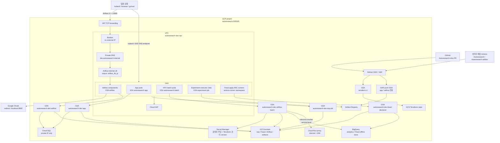
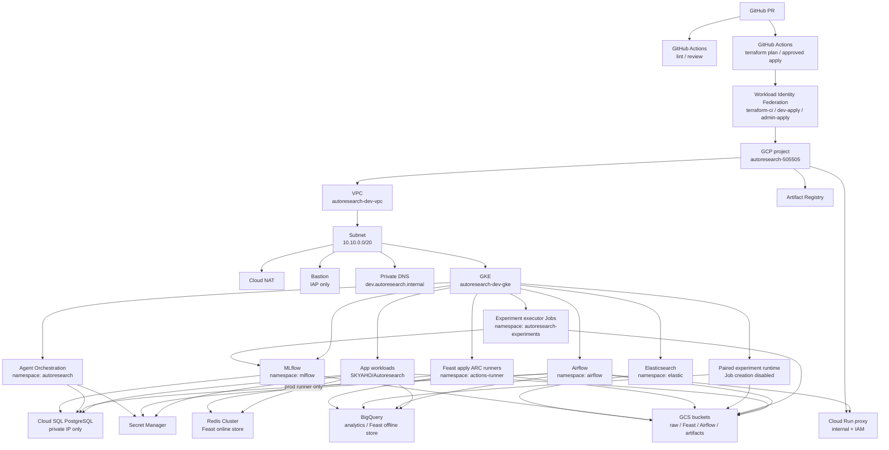
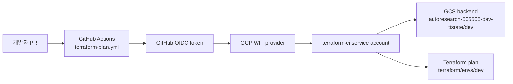
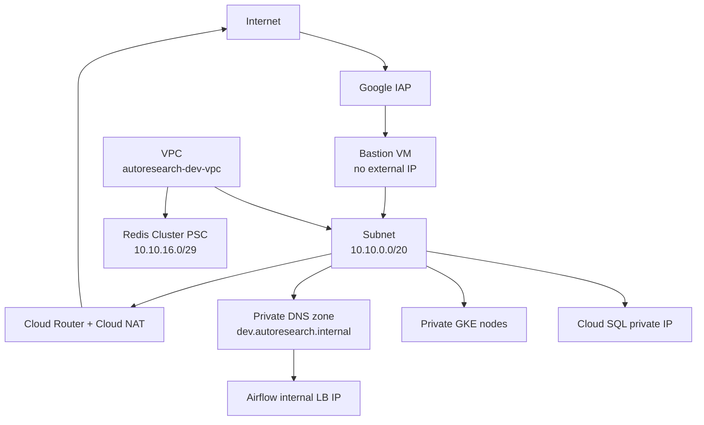
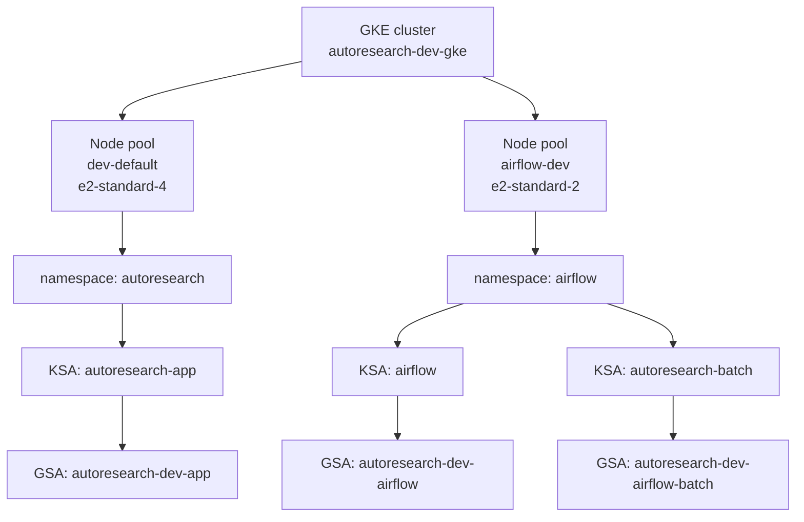
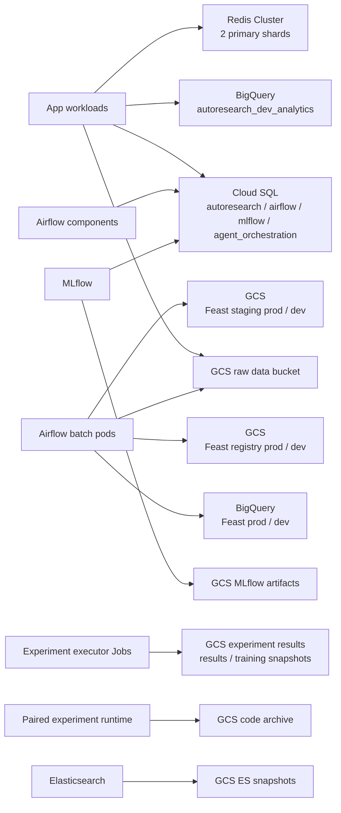
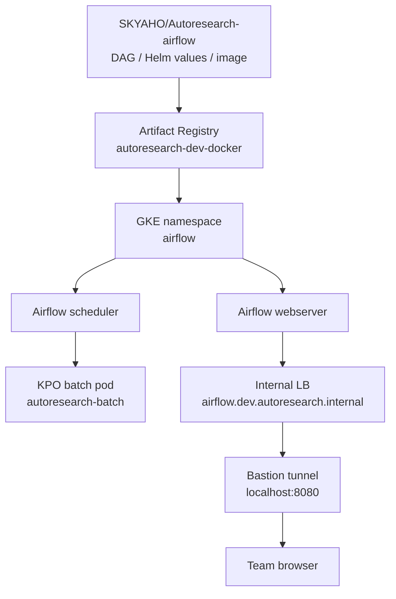
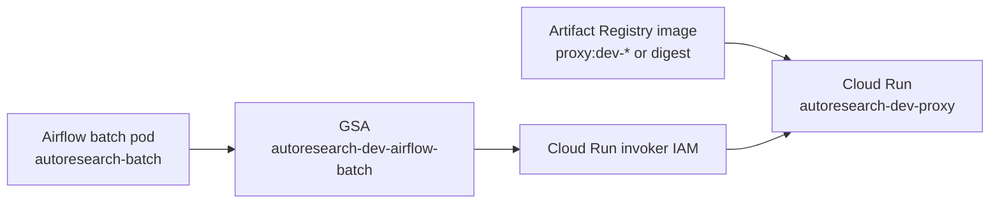
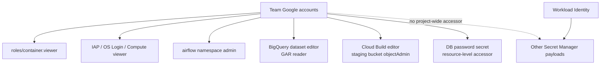

# AutoResearch dev 인프라 요약

지금까지 이 저장소에서 만든 dev 인프라의 현재 모습을 한눈에 보기 위한 문서다.
세부 변수, apply 절차, 운영 명령은 `TERRAFORM_DEV.md`와
`TEAM_OPERATIONS_RUNBOOK.md`를 우선한다.

> #424에서 설계한 Feast dev/prod 런타임 경계는 #541에서 ARC self-hosted runner
> 경로로 이관됐습니다. 현재 기본 경로는 `actions-runner` namespace의 환경별 scale
> set과 KSA/Workload Identity이며, 기존 Environment WIF와 GKE Job 구성은 rollback
> 경로로 보존합니다. 코드 구성과 과거 rollout 기록은 확인했지만 최신 live 상태는
> ArgoCD와 클러스터에서 다시 확인합니다.

> #485의 paired Feast experiment runtime도 dev Terraform 계약만 추가된 상태입니다.
> `experiment-runtime`의 Job 생성은 `job_creation_enabled=false`로 fail-closed이며,
> Airflow는 Job 생성 시도를 중단해야 합니다. 운영·음성 검증 계약은
> [`runbooks/2026-08-02-paired-feast-experiment-runtime.md`](runbooks/2026-08-02-paired-feast-experiment-runtime.md)를 따릅니다.

> #484 Auto Research 실험 Job 경계는 apply·go-live를 마쳤습니다. `enable_experiment_job_creation`이
> `true`로 전환됐고(#523, `terraform/admin/autoresearch-k8s/variables.tf`
> default), 실험 브랜치 생성 주체는 API에서 launcher CronJob으로 옮겨졌습니다
> (#539/#540). CronJob 매니페스트는 이 저장소의
> `deploy/agent-orchestration/launcher-cronjob.yaml`이 소유하며 ArgoCD Application
> `agent-orchestration`이 배포합니다. 2026-08-06 `kubectl` 확인 시점에는
> `agent-orchestration-launcher`가 1분 주기로 정상 실행 중이었으나, 최신 live 상태는
> ArgoCD와 클러스터에서 다시 확인합니다.
>
> #562에서 Phase 2 executor 경계를 추가했습니다. 어드미션 계약이 Job 종류별
> (`app.kubernetes.io/component`) 계약으로 일반화됐고, 8-container executor
> (initContainer 7 + app 1) 계약과 전용 egress
> (`experiment-jobs-executor-egress`, 공개 443 + in-cluster Experiment API + MLflow)가
> 추가됐습니다. Phase 1 `branch-bootstrap` 계약·egress는 롤백 경로로 보존합니다 —
> 앱 `launcher/main.py`에 Phase 1/2 스위치가 없어 전환·롤백이 launcher image
> digest 하나로 결정되기 때문입니다. 실험 namespace에 Secret 2종
> (`autoresearch-experiment-codex-auth`,
> `autoresearch-experiment-executor-api-token`)이 **선행 등록**되어야 하며 절차는
> [`runbooks/2026-08-01-auto-research-experiment-job.md`](runbooks/2026-08-01-auto-research-experiment-job.md)에
> 있습니다. 현재 Stage 1 배선은 executor immutable digest, 게시된 학습 snapshot,
> GCS 결과 root, in-cluster Experiment API와 MLflow tracking URI를 launcher에
> 고정합니다. Job 실행 상한(`activeDeadlineSeconds`)은 60,000초, Codex subprocess
> 상한은 6,000초이며 완료 Job 보존 TTL은 별도 3,600초입니다. 이 저장소 코드로는
> 실행 경로 구성을 확인할 수 있지만 특정 실험의 완료 판정·dev merge·main Draft PR
> 생성 여부는 애플리케이션 상태와 live 증적으로 별도 확인해야 합니다.
>
> 바로 아래 #485 블록의 `job_creation_enabled=false`는 이것과는 별개로
> `terraform/envs/dev/outputs.tf`·`terraform/admin/autoresearch-k8s/outputs.tf`에 하드코딩된
> 다른 계약(paired Feast experiment runtime, fail-closed)이며 이름이 비슷해
> 혼동하기 쉽습니다.

## 기본 정보

| 항목 | 값 |
|---|---|
| GCP project | `autoresearch-505505` |
| 기본 region / zone | `asia-northeast3` / `asia-northeast3-a` |
| Terraform dev root | `terraform/envs/dev` |
| Bootstrap root | `terraform/bootstrap` |
| Kubernetes admin roots | `terraform/admin/autoresearch-k8s`, `terraform/admin/airflow-k8s`, `terraform/admin/monitoring-k8s`, `terraform/admin/argocd-k8s`, `terraform/admin/argo-rollouts-k8s`, `terraform/admin/elastic-k8s`, `terraform/admin/mlflow-k8s`, `terraform/admin/actions-runner-k8s` (= `apply.yml`의 `ADMIN_ROOTS` 8개). `terraform/admin/gke-team-access`는 GCP IAM root이고, `terraform/admin/vault-k8s`는 #412에서 운영 제외되어 #478에서 root 디렉터리가 삭제됐습니다(원격 state 정리는 승인 대기). 둘 다 CI apply 대상에서 제외됩니다. | 별도 state |
| 일반 애플리케이션 저장소 | `SKYAHO/Autoresearch` |
| Airflow 저장소 | `SKYAHO/Autoresearch-airflow` |

## 운영 관점 한 장 요약

아래 다이어그램은 팀원이 실제로 접속하거나, CI가 plan을 돌리거나, Airflow batch가
데이터를 적재할 때의 큰 흐름을 한 장으로 압축한 것이다. 세부 리소스 설명은 뒤의
인프라별 상세 구조를 기준으로 본다.

```mermaid
flowchart TB
    member["팀원 로컬<br/>kubectl / browser / gcloud"]
    github["GitHub<br/>Autoresearch-infra PR"]
    apprepo["이미지 배포 Actions<br/>Autoresearch / Autoresearch-airflow"]
    oauth["Google OAuth<br/>redirect: localhost:8080"]

    subgraph gcp["GCP project<br/>autoresearch-505505"]
        iap["IAP TCP forwarding"]
        wif["GitHub OIDC / WIF"]
        state["GCS Terraform state"]

        subgraph vpc["VPC<br/>autoresearch-dev-vpc"]
            bastion["Bastion<br/>no external IP"]
            dns["Private DNS<br/>dev.autoresearch.internal"]
            ilb["Airflow internal LB<br/>output: airflow_ilb_ip"]
            nat["Cloud NAT"]

            subgraph gke["GKE<br/>autoresearch-dev-gke"]
                app["App pods<br/>KSA autoresearch-app"]
                airflow["Airflow components<br/>KSA airflow"]
                batch["KPO batch pods<br/>KSA autoresearch-batch"]
                experiment["Experiment executor Jobs<br/>KSA experiment-job"]
                arc["Feast apply ARC runners<br/>actions-runner namespace"]
            end
        end

        sql["Cloud SQL<br/>private IP only"]
        gcs["GCS buckets<br/>raw / Feast / Airflow / artifacts"]
        bq["BigQuery<br/>analytics / Feast offline store"]
        sm["Secret Manager<br/>운영자 주입 + Terraform 관리 version"]
        ar["Artifact Registry"]
        run["Cloud Run proxy<br/>internal + IAM"]

        cisa["GSA<br/>terraform-ci"]
        pushgsa["GAR push GSA<br/>app / airflow 전용"]
        appgsa["GSA<br/>autoresearch-dev-app"]
        airflowgsa["GSA<br/>autoresearch-dev-airflow"]
        batchgsa["GSA<br/>autoresearch-dev-airflow-batch"]
        experimentgsa["GSA<br/>autoresearch-dev-exp-job"]
        feastgsa["GSA<br/>autoresearch-dev-feast-dev/prod"]
    end

    member -->|"Airflow UI: -L 8080"| iap --> bastion --> dns --> ilb --> airflow
    airflow --> oauth
    member -->|"kubectl: GKE DNS endpoint"| gke
    github --> wif --> cisa --> state
    apprepo --> wif --> pushgsa --> ar

    app --> appgsa
    airflow --> airflowgsa
    batch --> batchgsa
    experiment --> experimentgsa
    arc --> feastgsa

    appgsa --> sql
    appgsa --> gcs
    airflowgsa --> sql
    airflowgsa --> gcs
    batchgsa --> sm
    batchgsa --> gcs
    batchgsa --> bq
    batchgsa -->|"roles/run.invoker<br/>service-level"| run
    experimentgsa --> gcs
    feastgsa --> gcs
    feastgsa --> bq

    gke --> ar
    gke --> nat
```

접근 흐름 요약:

| 구분 | 경로 | 인증/권한 |
|---|---|---|
| Airflow UI | 로컬 `gcloud compute ssh --tunnel-through-iap -L 8080:airflow.dev.autoresearch.internal:8080` → `http://localhost:8080` | IAP, OS Login, Google OAuth |
| kubectl | `gcloud container clusters get-credentials ... --dns-endpoint` | `roles/container.viewer` + GKE auth plugin |
| 내부 운영 UI | `kubectl port-forward`: ArgoCD `8443:443`, Grafana `3000:80`, MLflow OAuth proxy `4180:4180`, Kibana OAuth proxy `4181:4180`, Agent Orchestration UI `8501:8501` | ClusterIP 또는 internal LoadBalancer의 내부 경로이며 외부 공개는 없다. 서비스별 Google OAuth·OIDC 또는 API token 경계는 운영 runbook 기준 |
| PR plan | GitHub Actions → OIDC/WIF → CI service account → GCS state/dev plan | service account key 없음 |
| 승인 apply | `apply.yml` dispatch → GitHub Environment reviewer 승인 → OIDC/WIF → dev root 후 admin root 8개 | 로컬 apply는 break-glass/import 선행용 |
| 이미지 push | Autoresearch 또는 Autoresearch-airflow Actions → OIDC/WIF → 저장소별 pusher SA → 기존 GAR | provider 허용 목록 + SA principalSet 2단 경계, repository 단위 writer |
| Feast apply(#541) | Autoresearch Actions → 환경별 ARC scale set(`feast-apply-dev`/`feast-apply-prod`) → runner KSA/WI → 환경별 GSA | GitHub App으로 runner 등록, 환경별 GCS/BQ 경계; prod runner만 Redis PSC egress. 기존 Environment WIF → GKE Job 경로는 롤백용으로 유지 |
| Cloud Run proxy | Airflow batch pod → Workload Identity → batch GSA → Cloud Run ID token → proxy | `roles/run.invoker`는 필요조건. ID token, `YOUTUBE_PROXY_URL`, `X-Goog-Api-Key`, VPC 내부 경로가 함께 필요 |

## 이 문서에서 쓰는 기본 용어

새로운 용어가 나오면 아래 정의를 먼저 기준으로 읽는다. 더 구체적인 설정값은 각
인프라 섹션의 "주요 설정 상세" 표에 다시 설명한다.

| 용어 | 뜻 | 이 인프라에서의 의미 |
|---|---|---|
| Project | GCP 리소스를 담는 최상위 논리 공간 | `autoresearch-505505` 하나에 dev 인프라를 구성 |
| Region | GCP 리소스가 위치하는 지리적 권역 | `asia-northeast3` 서울 region |
| Zone | Region 안의 더 작은 가용 영역 | `asia-northeast3-a`에 zonal GKE와 Bastion 배치 |
| Terraform root | Terraform을 실행하는 기준 디렉터리 | `terraform/envs/dev`, `terraform/bootstrap`, `terraform/admin/*` |
| State | Terraform이 "내가 관리 중"이라고 기억하는 리소스 목록 | GCS backend bucket에 저장 |
| Backend | Terraform state 저장 위치 설정 | `autoresearch-505505-dev-tfstate` GCS bucket 사용 |
| CIDR | IP 주소 범위를 표현하는 표기법 | `10.10.0.0/20`처럼 subnet 대역을 표현 |
| VPC | 클라우드 안의 사설 네트워크 | dev 리소스가 서로 통신하는 네트워크 경계 |
| Subnet | VPC 안에서 IP 대역을 나눈 구간 | `10.10.0.0/20` dev subnet |
| Private IP | 인터넷에서 직접 접근할 수 없는 내부 IP | GKE node, Cloud SQL, Airflow ILB에 사용 |
| Cloud NAT | private 리소스가 외부로 나갈 때 쓰는 NAT | GKE node가 이미지 pull/API 호출을 할 때 사용 |
| Bastion | 내부망으로 들어가기 위한 점프 서버 | IAP 터널 종단, Airflow UI 접속 경로 |
| IAP | Google 계정/IAM 기반 터널 접근 기능 | Bastion SSH를 외부 IP 없이 열기 위해 사용 |
| GKE | Google 관리형 Kubernetes | 앱과 Airflow가 실행되는 클러스터 |
| Kubernetes | 컨테이너를 여러 서버에 배포/운영하는 시스템 | GKE가 관리형 Kubernetes를 제공 |
| Pod | Kubernetes에서 컨테이너가 실행되는 최소 단위 | 앱 pod, Airflow component pod, batch pod |
| Namespace | Kubernetes 리소스를 논리적으로 나누는 공간 | Airflow는 `airflow` namespace에 격리 |
| Node pool | 같은 사양의 GKE worker node 묶음 | 일반 앱용 `dev-default`, Airflow용 `airflow-dev` |
| KSA | Kubernetes ServiceAccount | pod가 Kubernetes 안에서 쓰는 신원 |
| GSA | Google Service Account | GCP API 접근 권한을 받는 신원 |
| Workload Identity | KSA가 GSA를 가장하게 하는 GKE 기능 | JSON key 없이 pod에 GCP 권한 부여 |
| RBAC | Kubernetes 권한 제어 방식 | 팀원에게 `airflow` namespace admin 권한 부여 |
| NetworkPolicy | Kubernetes pod 간 통신을 제한하는 정책 | Airflow namespace ingress/egress 제한 |
| Ingress | 밖에서 안으로 들어오는 트래픽 | Airflow UI 8080 접근 허용 범위 |
| Egress | 안에서 밖으로 나가는 트래픽 | GKE node/Pod의 외부 API 호출 경로 |
| IAM | GCP 권한 관리 체계 | 사람/서비스 계정별 최소 권한 부여 |
| Secret Manager | 민감값 저장 서비스 | API key·OAuth 자격·DB password·Redis server CA·ARC GitHub App 자격 저장소. DB password와 Redis CA version은 Terraform 관리 예외라 state 접근 통제가 필요 |
| Payload | secret의 실제 값 본문 | 원칙적으로 문서/PR에 쓰지 않는다. 운영자 주입 값과 Terraform 관리 DB password·Redis CA version을 구분 |
| Service account key | service account 장기 인증 키 파일 | 유출 위험 때문에 발급하지 않는 것이 원칙 |
| GCS | Google Cloud Storage | 원본 데이터, DAG/log, Feast registry/staging, MLflow·코드·실험·ES snapshot artifact 저장 |
| BigQuery | 분석용 columnar data warehouse | 분석 dataset과 Feast offline store |
| Cloud SQL | 관리형 RDBMS | PostgreSQL 앱·Airflow·MLflow·Agent Orchestration DB |
| Artifact Registry | 컨테이너 이미지 저장소 | 앱/Airflow/Cloud Run 이미지 저장 |
| Cloud Run | 컨테이너를 serverless로 실행하는 서비스 | dev proxy 서비스 |
| ILB | Internal Load Balancer | Airflow UI를 VPC 내부에만 노출 |
| Private DNS | VPC 내부에서만 해석되는 DNS | `airflow.dev.autoresearch.internal` |
| DNS endpoint | GKE control plane에 DNS 이름으로 접속하는 방식 | 팀원 IP 등록 없이 IAM으로 kubeconfig 발급 |
| OIDC | 짧게 발급되는 신원 토큰 표준 | GitHub Actions가 GCP에 인증할 때 사용 |
| WIF | Workload Identity Federation | GitHub OIDC를 GCP service account로 연결 |
| ARC | Actions Runner Controller | `actions-runner` namespace에서 GitHub Actions ephemeral self-hosted runner를 scale set으로 관리 |
| OAuth | 외부 계정 로그인을 위임하는 인증 표준 | Airflow Google 로그인에 사용 |
| KPO | KubernetesPodOperator | Airflow DAG에서 Kubernetes pod를 띄우는 operator |
| Proxy | 호출을 대신 받아 내부 서비스로 전달하거나 중계하는 컴포넌트 | dev Cloud Run proxy |
| Invoker | Cloud Run을 호출할 수 있는 IAM 권한 주체 | Airflow batch GSA가 dev proxy를 호출 |
| Image tag | 컨테이너 이미지 버전 이름 | `proxy:dev-YYYYMMDD-N` 같은 재배포 단위 |
| Digest | 컨테이너 이미지 내용 기반 고정 식별자 | `sha256:...` 형식, 같은 내용이면 값이 고정 |
| Metadata DB | 시스템 내부 상태를 저장하는 DB | Airflow scheduler/webserver 상태 저장 |
| Offline store | 모델 학습/과거 조회용 feature 저장소 | Feast가 BigQuery dataset을 사용 |

## 전체 구조

```mermaid
flowchart TB
    gh["GitHub PR"]
    checks["GitHub Actions<br/>lint / review"]
    ci["GitHub Actions<br/>terraform plan / approved apply"]
    wif["Workload Identity Federation<br/>terraform-ci / dev-apply / admin-apply"]
    gcp["GCP project<br/>autoresearch-505505"]

    vpc["VPC<br/>autoresearch-dev-vpc"]
    subnet["Subnet<br/>10.10.0.0/20"]
    nat["Cloud NAT"]
    bastion["Bastion<br/>IAP only"]
    dns["Private DNS<br/>dev.autoresearch.internal"]

    gke["GKE<br/>autoresearch-dev-gke"]
    app["App workloads<br/>SKYAHO/Autoresearch"]
    airflow["Airflow<br/>namespace: airflow"]
    agent["Agent Orchestration<br/>namespace: autoresearch"]
    experiment["Experiment executor Jobs<br/>namespace: autoresearch-experiments"]
    paired["Paired experiment runtime<br/>Job creation disabled"]
    arc["Feast apply ARC runners<br/>namespace: actions-runner"]
    mlflow["MLflow<br/>namespace: mlflow"]
    elastic["Elasticsearch<br/>namespace: elastic"]

    sql["Cloud SQL PostgreSQL<br/>private IP only"]
    gcs["GCS buckets<br/>raw / Feast / Airflow / artifacts"]
    bq["BigQuery<br/>analytics / Feast offline store"]
    redis["Redis Cluster<br/>Feast online store"]
    sm["Secret Manager"]
    ar["Artifact Registry"]
    run["Cloud Run proxy<br/>internal + IAM"]

    gh --> checks
    gh --> ci --> wif --> gcp
    gcp --> vpc --> subnet
    subnet --> nat
    subnet --> bastion
    subnet --> dns
    subnet --> gke
    gke --> app
    gke --> airflow
    gke --> agent
    gke --> experiment
    gke --> paired
    gke --> arc
    gke --> mlflow
    gke --> elastic
    app --> sql
    app --> redis
    app --> gcs
    app --> bq
    app --> sm
    airflow --> sql
    airflow --> gcs
    airflow --> bq
    airflow --> sm
    airflow --> run
    agent --> sql
    agent --> sm
    experiment --> gcs
    experiment --> mlflow
    paired --> gcs
    paired --> bq
    arc --> gcs
    arc --> bq
    arc -->|"prod runner only"| redis
    mlflow --> sql
    mlflow --> gcs
    elastic --> gcs
    gcp --> ar
    gcp --> run
```

## Terraform 구성의 주요 관리 대상

| 영역 | 주요 리소스 | 목적 |
|---|---|---|
| Network | `autoresearch-dev-vpc`, `autoresearch-dev-subnet` | dev 리소스가 배치되는 사설 네트워크 |
| Egress | `autoresearch-dev-router`, `autoresearch-dev-nat` | private GKE node의 외부 API/이미지 pull egress |
| Bastion | `autoresearch-dev-bastion` | IAP 터널로 VPC 내부 서비스에 접근하는 진입점 |
| DNS / ILB | `dev.autoresearch.internal`, `airflow.dev.autoresearch.internal`, `mlflow.dev.autoresearch.internal`(#244), Airflow·MLflow ILB 예약 IP | Airflow·MLflow UI를 VPC 내부에서만 접근 |
| Artifact Registry | `autoresearch-dev-docker` | 애플리케이션/Airflow 컨테이너 이미지 저장 |
| Cloud SQL | `autoresearch-dev-pg`, DB 4개(`autoresearch`, `airflow`, `mlflow`, `agent_orchestration`), Terraform user 3종(`app`, `mlflow`, `agent_orchestration`) | 앱 DB·Airflow metadata DB·MLflow backend DB·Agent Orchestration 상태 DB. Airflow 전용 SQL user는 코드에 없음 |
| Redis Cluster | `autoresearch-dev-redis-cluster` | Feast Online Store, single-zone primary shard 2개, private PSC + IAM auth/TLS (#129, apply·검증 완료) |
| GKE | `autoresearch-dev-gke`, node pool `dev-default`, `airflow-dev`, `batch-spot`(#173), `batch-od`(#297), `ctr-model-retrain`(#316) | 앱 워크로드와 Airflow 실행 기반. batch-spot은 재시도 내성 있는 KPO, batch-od는 재시도 내성 없는 장시간 KPO용 |
| Cloud Run | `autoresearch-dev-proxy` | 내부 전용 proxy 서비스, invoker IAM 기반 |
| GCS | raw data, prod/dev Feast registry·staging, Airflow DAG/log, MLflow artifact, code artifact, experiment result, ES snapshot bucket | 원본 데이터, 환경별 feature store 메타데이터, 배포 코드, 실험·학습·로그 artifact 저장 |
| BigQuery | `autoresearch_dev_analytics`(임베딩 중간 테이블 2종 IaC #296 포함), `feast_offline_store`, `feast_offline_store_dev`, `data_lake_raw`(#286) | 분석·환경별 Feast offline store·raw 계층 |
| Vertex AI | BigQuery↔Vertex `CLOUD_RESOURCE` connection(#281) | BigQuery ML `ML.GENERATE_EMBEDDING` 다국어 임베딩 호출 |
| MLflow | `mlflow` ns — tracking server(#94), 전용 Cloud SQL DB/user + Secret(#93), artifact GCS bucket + 전용 GSA(#92), OAuth2-proxy + 내부 ILB(#232/#244) | 실험 추적 UI. 내부 ILB + Google OAuth |
| Secret Manager | 앱·MLflow·Agent Orchestration DB password, Redis CA, YouTube/OpenRouter API key, UI OAuth client, Agent Orchestration Codex bootstrap, ARC GitHub App 자격 컨테이너 | DB password와 Redis CA는 Terraform이 version까지 관리해 state에 값이 남는다. API key·OAuth·Codex bootstrap·GitHub App payload는 운영자가 Terraform 밖에서 주입한다. OAuth와 K8s Secret 사본 관계·allowlist·갱신은 [`OAUTH_OPERATIONS_RUNBOOK.md`](OAUTH_OPERATIONS_RUNBOOK.md) 및 서비스별 runbook 기준 |
| IAM / WI | `gke-team-access` human IAM, GKE node SA, app SA, Airflow SA, Airflow batch SA, proxy SA, CI SA, GAR pusher SA(#121), 코드 업로더 SA(#238), dev/prod Feast apply SA와 WIF·ARC runner KSA(#424/#541), experiment runtime GSA/KSA(#485, Job create disabled), experiment Job GSA/KSA, Agent Orchestration API·runner·launcher·로그 수집기·PR 생성기 GSA/KSA(#616 수집기는 `experiment-job-observer`만 갖고 Job 생성 권한은 없다, #630 PR 생성기는 Kubernetes RBAC도 토큰 마운트도 없다), ARC controller GSA/KSA, Cloud Build SA(#269/#272), MLflow GSA(#92), ES snapshot GSA(#102), admin-apply SA(#307), dev-apply SA(#341) | 워크로드·환경별 최소 권한과 Workload Identity. 팀원 IAM에는 DB password secret 하나의 accessor 예외가 있다. #485 paired runtime은 production 접근과 public HTTPS egress를 허용하지 않는다. 실험 Job은 전용 결과 bucket create/read와 게시된 학습 snapshot read만 갖는다. Vault GSA/WI 바인딩/custom role은 #478 코드에서 제거됐고 승인 apply로 destroy 대기 중 |
| 모니터링 | kube-prometheus-stack (`monitoring` ns, #79) — Prometheus 7d/30Gi, Grafana(Google OAuth #155). 커스텀 대시보드 7장 as-code(K8s 리소스·네트워크·스케일 판단·MLflow·Airflow·Serving·rerank load test), 수집: serving ServiceMonitor(#302)·mlflow oauth2-proxy PodMonitor(#357)·airflow statsd ServiceMonitor+ingress 9102(#358) | 운영 관측 dashboard. 접근은 port-forward. 대시보드는 `deploy/monitoring/dashboards/*.json`이 정본 |
| GitOps | ArgoCD(#84, Google OIDC 로그인 #292) + AppProject(#85). Application 9개: `monitoring`·`argo-rollouts`·`mlflow`·`serving`·`agent-orchestration`·`actions-runner-controller`·`actions-runner-scale-set`·`actions-runner-scale-set-feast-dev`·`actions-runner-scale-set-feast-prod` | `agent-orchestration`은 enable flag가 true일 때만 `main` 자동 sync하며, 나머지 8개는 자동 sync한다. 자동 sync가 활성화된 Application의 `automated` 설정은 모두 `prune=false`, `selfHeal=false`라 삭제와 live drift 회수는 자동화하지 않는다. |
| Actions Runner Controller | `actions-runner` ns, controller 1개 + scale set 3개(PoC/dev/prod) | GitHub Actions ephemeral runner를 0~4/0~2/0~2로 확장한다. Terraform admin root는 namespace/KSA/quota/NetworkPolicy, ArgoCD는 chart를 소유한다. |
| 로그(ELK) | ECK operator(#97), ES single-node 30Gi(#98), Kibana(#99, oauth2-proxy Google 로그인 + basic 인증 — anonymous 폐기 #325), Filebeat allowlist 수집(#100, ndjson 구조화 파싱 #359, 자기 로그 관측 #365), ILM(#101)/snapshot(#102)/runbook(#103), saved object 자동 import Job(#365) — `elastic` ns | airflow/autoresearch 로그 검색·분석 + Logs Overview 대시보드. Airflow task 로그 정본은 GCS 원격 로깅(airflow#147) — ELK는 stdout만 |
| Secret(학습) | Vault 운영 제외(#412) | 실 서비스 secret은 Secret Manager. Vault dev root 코드(`vault.tf`)와 `terraform/admin/vault-k8s` root는 #478에서 삭제 완료, 원격 state 정리(GSA/WI 바인딩/custom role/key IAM binding 4개 destroy)는 승인 대기 |
| KMS | `autoresearch-dev-vault` key ring / `vault-unseal` crypto key (#132) | Vault workload는 없음. GCP에서 삭제 불가능한 리소스라 `kms_vault_orphan.tf`(#478)로 config 유지 — rotation 제거 + `prevent_destroy`, 나머지 Vault IAM 리소스는 destroy 대상으로 분리 — 승인 apply 대기 |
| DNS(googleapis) | private zone `googleapis.com` → 199.36.153.8/30 (#138) | VPC의 Google API private routing. Vault 전용 운영 경로는 폐기됨 |
| CI 자동화 | PR plan(#6) + **일일 drift 감지**(#153) + **단일 진입점 승인 게이트 CI apply**(`apply.yml`, #451 — admin root #307/#312/#533 + dev root #341 통합) | drift 시 [DRIFT] 이슈 자동 생성. dev root + K8s admin root 8개(#412로 `vault-k8s` 제외)를 한 번의 dispatch·승인으로 CI apply(순서: dev root 먼저), 로컬 apply는 break-glass |

## 인프라별 상세 구조

### 1. Terraform / CI / State

```mermaid
flowchart LR
    dev["개발자 PR"]
    actions["GitHub Actions<br/>terraform-plan.yml"]
    oidc["GitHub OIDC token"]
    wif["GCP WIF provider"]
    cisa["terraform-ci service account"]
    state["GCS backend<br/>autoresearch-505505-dev-tfstate/dev"]
    plan["Terraform plan<br/>terraform/envs/dev"]

    dev --> actions --> oidc --> wif --> cisa
    cisa --> state
    cisa --> plan
```

- `terraform/bootstrap`은 Terraform state bucket, GitHub OIDC용 WIF pool/provider,
  CI service account를 만든다. bootstrap은 초기 1회성 성격이 강하다.
- `terraform/envs/dev`는 실제 dev 인프라 root module이다. VPC, GKE, Cloud SQL,
  GCS, BigQuery, Cloud Run, Secret Manager, Airflow GCP 리소스가 여기 있다.
- PR이 열리면 GitHub Actions가 실제 GCP 자격 증명을 service account key 없이
  OIDC/WIF로 얻고, dev root에 대해 plan을 실행한다.
- dev root apply(#341)와 K8s admin root 8개 apply(#307/#312/#533, #412로 vault-k8s
  제외)는 `apply.yml` 승인 게이트 CI apply로 이관됐다(#451에서 단일 워크플로우로
  통합 — 한 번의 dispatch·승인으로 전체 적용, 민감 tfvars는 GitHub Secrets 단일
  원천). 로컬 apply는 break-glass. gke-team-access(사람 IAM)는 로컬 유지(#314).

주요 설정 상세:

| 설정 | 값/위치 | 설명 |
|---|---|---|
| `terraform/bootstrap` | 별도 root | state bucket, WIF, CI SA처럼 dev root를 실행하기 전에 필요한 기반을 만든다. |
| `terraform/envs/dev` | dev root | 실제 dev GCP 리소스 대부분을 관리한다. |
| `terraform/admin/gke-team-access` | 별도 state | 팀원 Google 계정 IAM을 관리한다. 사람 이메일이 일반 PR plan에 노출되지 않게 분리했다. |
| `terraform/admin/autoresearch-k8s` | 별도 state | 일반 앱 namespace/KSA와 Cloud SQL/Redis 최소 egress, 환경별 Feast apply GKE Job 롤백 경계(#424), paired `experiment-runtime` fail-closed 경계(#485), `autoresearch-experiments` Job/RBAC/admission/quota/Phase 1·2 egress, `loadtest` namespace의 `rerank-loadtest-*` 경계를 관리한다. #485 `job_creation_enabled`는 disabled이고 Auto Research 실험 Job 생성 권한은 별도 `enable_experiment_job_creation=true`다. |
| `terraform/admin/airflow-k8s` | 별도 state | Kubernetes namespace/RBAC/NetworkPolicy를 관리한다. GKE API 접근이 필요해 dev root와 분리했다. |
| `terraform/admin/monitoring-k8s` | 별도 state | monitoring namespace와 port-forward RBAC(플랫폼 경계)를 관리한다. chart는 #183에서 ArgoCD Application `monitoring`으로 이관(helm_release 제거). |
| `terraform/admin/actions-runner-k8s` | 별도 state | `actions-runner` namespace, ARC controller·runner KSA, quota/LimitRange와 deny-by-default NetworkPolicy를 관리한다. chart와 scale set은 ArgoCD Application이 소유한다. |
| `terraform/admin/argocd-k8s` | 별도 state | ArgoCD namespace·argo-cd Helm release·AppProject와 Application 9개를 관리한다. AppProject destination은 `monitoring`, `argo-rollouts`, `kube-system`, `mlflow`, `autoresearch`, `actions-runner` 6개다. |
| `terraform-plan.yml` | GitHub Actions | PR마다 fmt/validate/plan을 실행하고 결과를 댓글/check로 보여준다. |
| WIF/OIDC | GitHub Actions -> GCP | service account JSON key 없이 CI가 GCP 권한을 얻는다. 키 파일 유출 위험을 줄이기 위한 설정이다. |
| Apply 승인 게이트 | GitHub Environment | plan은 자동, apply는 Environment required reviewer 승인 후 CI가 수행한다(admin-apply·dev-apply). 로컬 apply는 break-glass·import 선행용으로만 남긴다. |

### 2. 네트워크 / NAT / Bastion / DNS

```mermaid
flowchart TB
    internet["Internet"]
    iap["Google IAP"]
    bastion["Bastion VM<br/>no external IP"]
    vpc["VPC<br/>autoresearch-dev-vpc"]
    subnet["Subnet<br/>10.10.0.0/20"]
    nat["Cloud Router + Cloud NAT"]
    dns["Private DNS zone<br/>dev.autoresearch.internal"]
    ilb["Airflow internal LB IP"]
    gke["Private GKE nodes"]
    sql["Cloud SQL private IP"]
    redispsc["Redis Cluster PSC<br/>10.10.16.0/29"]

    internet --> iap --> bastion --> subnet
    vpc --> subnet
    subnet --> nat --> internet
    subnet --> dns --> ilb
    subnet --> gke
    subnet --> sql
    vpc --> redispsc
```

- VPC는 dev 리소스의 기본 네트워크 경계다. GKE node, Bastion, Cloud SQL private IP,
  Redis Cluster PSC endpoint, Airflow internal LB가 이 경계 안에서 동작한다.
- GKE node에는 외부 IP가 없어서 Artifact Registry 이미지 pull, Google APIs 호출,
  외부 API 호출은 Cloud NAT를 통해 나간다.
- Bastion은 외부 IP가 없고 IAP TCP forwarding으로만 접속한다. 팀원은 Bastion을
  통해 Airflow UI 같은 VPC 내부 서비스로 터널을 연다.
- `airflow.dev.autoresearch.internal`은 private DNS zone에 있는 내부 도메인이다.
  로컬 PC에서 바로 해석되는 공개 DNS가 아니라, Bastion 터널 또는 VPC 내부에서 쓰는
  이름이다.

주요 설정 상세:

| 설정 | 값 | 설명 |
|---|---|---|
| VPC | `autoresearch-dev-vpc` | dev 인프라 전용 네트워크다. 리소스 간 내부 통신 경계를 만든다. |
| Subnet | `autoresearch-dev-subnet`, `10.10.0.0/20` | GKE node, Bastion, internal LB 등이 들어가는 IP 대역이다. |
| Redis PSC subnet | `autoresearch-dev-redis-psc`, `10.10.16.0/29` | Redis discovery/internal backend 주소 두 개를 예약하는 전용 대역이다. |
| Private Google Access | enabled | private subnet의 VM/GKE node가 Google API에 접근할 수 있게 한다. |
| Cloud NAT | `autoresearch-dev-nat` | private node가 외부 API나 Artifact Registry에 나갈 때 공인 egress를 제공한다. |
| Bastion external IP | 없음 | 인터넷에서 VM으로 직접 SSH하지 못하게 막는다. |
| Bastion access | IAP TCP forwarding | Google 계정 + IAM으로 SSH 터널 접근을 제어한다. |
| Private DNS zone | `dev.autoresearch.internal` | VPC 내부 전용 이름 공간이다. 공개 인터넷 DNS가 아니다. |
| Airflow FQDN | `airflow.dev.autoresearch.internal` | Airflow internal LB IP를 가리키는 내부 도메인이다. |

### 3. GKE / Workload 실행 계층

```mermaid
flowchart TB
    cluster["GKE cluster<br/>autoresearch-dev-gke"]
    devpool["Node pool<br/>dev-default<br/>e2-standard-4"]
    airflowpool["Node pool<br/>airflow-dev<br/>e2-standard-2"]
    appns["namespace: autoresearch"]
    appksa["KSA: autoresearch-app"]
    airflowNS["namespace: airflow"]
    airflowKSA["KSA: airflow"]
    batchKSA["KSA: autoresearch-batch"]
    appgsa["GSA: autoresearch-dev-app"]
    airflowgsa["GSA: autoresearch-dev-airflow"]
    batchgsa["GSA: autoresearch-dev-airflow-batch"]

    cluster --> devpool --> appns --> appksa --> appgsa
    cluster --> airflowpool --> airflowNS
    airflowNS --> airflowKSA --> airflowgsa
    airflowNS --> batchKSA --> batchgsa
```

- `dev-default` node pool은 일반 앱 워크로드용이다.
- `airflow-dev` node pool은 Airflow component를 분리해 배치하기 위한 전용 node
  pool이다.
- `batch-spot`은 재시도 내성 batch, `batch-od`는 실험 executor처럼 재시도 내성이
  낮은 Job, `ctr-model-retrain`은 재학습 workload가 사용하는 min 0 pool이다.
- Kubernetes service account와 GCP service account는 Workload Identity로 연결한다.
  pod는 JSON key 없이 GCP 권한을 얻는다.
- `airflow/airflow`는 Airflow webserver/scheduler 등 component용이고,
  `airflow/autoresearch-batch`는 KubernetesPodOperator batch pod용이다.
- batch GSA는 YouTube/OpenRouter secret, raw data bucket, Feast registry/staging,
  BigQuery offline store에 필요한 권한만 갖는다. Cloud SQL metadata DB나 Airflow
  DAG/log bucket 권한은 Airflow component GSA가 담당한다.
- `autoresearch-experiments/experiment-job`은 `batch-od`에 executor Job을 실행하며
  전용 결과 bucket create/read와 게시된 학습 snapshot read만 허용한다.
- `actions-runner` namespace의 ARC는 controller 1개와 PoC/dev/prod scale set 3개를
  관리한다. Feast dev/prod runner KSA는 환경별 Feast GSA를 Workload Identity로
  가장하고, prod scale set에만 Redis PSC egress가 추가된다.

주요 설정 상세:

| 설정 | 값 | 설명 |
|---|---|---|
| Cluster | `autoresearch-dev-gke` | 앱과 Airflow를 실행하는 Kubernetes 클러스터다. |
| Cluster type | Standard zonal | node pool과 세부 설정을 Terraform으로 직접 다루기 위해 Standard로 구성했다. |
| Control plane endpoint | DNS endpoint 기본 | 팀원 IP allowlist 없이 IAM 기반으로 kubeconfig를 받을 수 있게 한다. |
| Node privacy | private nodes | worker node에 외부 IP를 붙이지 않는다. |
| `dev-default` node pool | `e2-standard-4` | 일반 앱 워크로드와 기본 system pod 여유를 고려한 node pool이다. |
| `airflow-dev` node pool | `e2-standard-2` | Airflow component를 일반 앱과 분리해 배치하기 위한 node pool이다. |
| App KSA/GSA | `autoresearch-app` -> `autoresearch-dev-app` | 일반 앱 pod가 DB password, Redis CA, cluster 한정 IAM 연결 token, Cloud SQL, GCS/BigQuery 권한을 얻는 경로다(#129, apply·검증 완료). |
| Airflow KSA/GSA | `airflow` -> `autoresearch-dev-airflow` | webserver/scheduler 등 Airflow component의 GCP 접근 경로다. |
| Batch KSA/GSA | `autoresearch-batch` -> `autoresearch-dev-airflow-batch` | KPO batch pod 전용 권한이다. Airflow component 권한과 분리했다. |
| Experiment Job KSA/GSA | `autoresearch-experiments/experiment-job` -> `autoresearch-dev-exp-job` | executor Job 결과와 immutable 학습 snapshot을 위한 전용 GCS 경계다. Job 생성은 `autoresearch/agent-orchestration-launcher` KSA에만 부여한다. |
| Feast apply ARC dev KSA/GSA | `actions-runner/feast-apply-dev-runner` -> `autoresearch-dev-feast-dev` | 현재 self-hosted runner 경로. dev GCS/BQ만 사용하며 Redis PSC egress가 없다(#541). |
| Feast apply ARC prod KSA/GSA | `actions-runner/feast-apply-prod-runner` -> `autoresearch-dev-feast-prod` | 현재 self-hosted runner 경로. prod GCS/BQ와 Redis/CA 권한, Redis PSC egress를 사용한다(#541). |
| Feast apply GKE Job 롤백 KSA/GSA | `feast-apply-{dev,prod}/feast-apply` -> 환경별 Feast GSA | 기존 환경별 GKE Job 경계(#424)를 롤백 경로로 보존한다. paired runtime과 별개다. |
| ARC controller KSA/GSA | `actions-runner/actions-runner-controller` -> `autoresearch-dev-runner` | ARC CRD와 ephemeral runner lifecycle을 `actions-runner` namespace 안에서 관리한다. |

### 4. 데이터 저장 계층

```mermaid
flowchart LR
    app["App workloads"]
    airflowComp["Airflow components"]
    batch["Airflow batch pods"]
    executor["Experiment executor Jobs"]
    paired["Paired experiment runtime"]
    mlflow["MLflow"]
    elastic["Elasticsearch"]
    raw["GCS raw data bucket"]
    bqanalytics["BigQuery<br/>autoresearch_dev_analytics"]
    feastbq["BigQuery<br/>Feast prod / dev"]
    registry["GCS<br/>Feast registry prod / dev"]
    staging["GCS<br/>Feast staging prod / dev"]
    sql["Cloud SQL<br/>autoresearch / airflow / mlflow / agent_orchestration"]
    redis["Redis Cluster<br/>2 primary shards"]
    experiment["GCS experiment results<br/>results / training snapshots"]
    mlflowArtifacts["GCS MLflow artifacts"]
    codeArtifacts["GCS code archive"]
    esSnapshots["GCS ES snapshots"]

    app --> raw
    app --> bqanalytics
    app --> sql
    app --> redis
    batch --> raw
    batch --> feastbq
    batch --> registry
    batch --> staging
    airflowComp --> sql
    executor --> experiment
    paired --> codeArtifacts
    mlflow --> sql
    mlflow --> mlflowArtifacts
    elastic --> esSnapshots
```

- GCS raw data bucket은 원본 데이터를 오래 남기는 landing zone이다. YouTube raw,
  action log raw, virtual user, persona snapshot이 prefix로 나뉜다.
- BigQuery `autoresearch_dev_analytics`는 분석/집계용 dataset이다.
- BigQuery `feast_offline_store`와 `feast_offline_store_dev`는 각각 prod/dev
  Feast feature table 저장소다.
- prod와 dev Feast registry/staging은 별도 bucket이다. prod는 기존 주소를
  유지하고 dev는 `-dev` bucket을 사용한다.
- Cloud SQL은 private IP only다. `autoresearch`, `airflow`, `mlflow`,
  `agent_orchestration` DB 4개를 같은 instance 안에서 용도별로 분리한다. Terraform이
  관리하는 SQL user는 app, MLflow, Agent Orchestration 3종이며 Airflow 전용 user는
  없다. batch pod는 Cloud SQL 권한이 아니라 raw data, Feast, BigQuery, API key
  secret 권한만 갖는다.
- Redis Cluster는 Feast Online Store이며 primary shard 두 개에 hash slot을
  분산한다. app pod는 PSC, IAM 인증과 TLS로만 접속한다.
- 게시된 training snapshot과 experiment result는 experiment result bucket 안의 서로
  다른 prefix에 저장한다. MLflow artifact, code archive, Elasticsearch snapshot은
  각각 별도 GCS bucket과 IAM 경계를 사용한다.

주요 설정 상세:

| 설정 | 값 | 설명 |
|---|---|---|
| Raw data bucket | `autoresearch-505505-autoresearch-dev-raw-data` | YouTube, action log, virtual user, persona 원본을 prefix로 나누어 저장한다. |
| Raw bucket versioning | enabled | 원본 데이터 실수 삭제/덮어쓰기 대응을 위해 versioning을 켰다. |
| Feast prod registry/staging | `gs://<project>-feast-registry/registry.db`, `gs://<project>-feast-staging/` | 기존 prod 객체·주소를 유지한다. |
| Feast dev registry/staging | `gs://<project>-feast-registry-dev/registry.db`, `gs://<project>-feast-staging-dev/` | bucket-level IAM에서 prod와 분리하며 ARC dev runner가 사용한다(#424/#541). |
| BigQuery analytics | `autoresearch_dev_analytics` | 분석/집계 결과를 저장하는 dataset이다. |
| BigQuery Feast | prod `feast_offline_store`, dev `feast_offline_store_dev` | 환경별 Feast offline feature table 저장소다. |
| Cloud SQL instance | `autoresearch-dev-pg` | PostgreSQL 15 dev instance다. private IP only로 구성했다. |
| Cloud SQL DB / user | DB `autoresearch`, `airflow`, `mlflow`, `agent_orchestration`; Terraform user `app`, `mlflow`, `agent_orchestration` | DB는 4개지만 user는 3종이다. `airflow` 전용 `google_sql_user`는 없으며 실제 metadata DB credential·전환 상태는 Airflow 저장소와 live 설정에서 확인한다. |
| Redis Cluster | `autoresearch-dev-redis-cluster` | `asia-northeast3-a` single-zone의 shared-core nano primary shard 2개, replica 0개인 dev Online Store다. |
| MLflow artifact bucket | `<project>-autoresearch-mlflow-artifacts` | MLflow artifact를 저장한다. 게시된 training snapshot은 experiment result bucket의 `training-snapshots/` prefix를 사용한다. |
| Code artifact bucket | `<project>-code-artifacts` | main 기준 코드 archive를 저장한다. app·Airflow batch·Feast apply와 paired experiment runtime에 read IAM이 있으며 Phase 2 executor Job GSA에는 없다. |
| Experiment result bucket | `<project>-autoresearch-dev-experiment-results` | executor 결과와 `training-snapshots/`의 게시된 학습 snapshot을 보관한다. Job GSA는 create/read만 갖고 delete 권한은 없다. |
| Elasticsearch snapshot bucket | `<project>-autoresearch-dev-es-snapshots` | Elasticsearch snapshot repository 전용 bucket이다. |

### 5. Airflow 운영 계층

```mermaid
flowchart TB
    repo["SKYAHO/Autoresearch-airflow<br/>DAG / Helm values / image"]
    ar["Artifact Registry<br/>autoresearch-dev-docker"]
    namespace["GKE namespace<br/>airflow"]
    web["Airflow webserver"]
    scheduler["Airflow scheduler"]
    batch["KPO batch pod<br/>autoresearch-batch"]
    ilb["Internal LB<br/>airflow.dev.autoresearch.internal"]
    bastion["Bastion tunnel<br/>localhost:8080"]
    user["Team browser"]

    repo --> ar
    ar --> namespace
    namespace --> web
    namespace --> scheduler
    scheduler --> batch
    web --> ilb --> bastion --> user
```

- Airflow DAG, Helm values, Airflow image/build 설정은
  `SKYAHO/Autoresearch-airflow`에서 관리한다.
- 이 인프라 저장소는 Airflow가 올라갈 namespace, RBAC, NetworkPolicy,
  Workload Identity, Secret/GCS/BigQuery/Cloud SQL 권한, 내부 UI 접근 경로를 만든다.
- Airflow UI는 인터넷에 공개하지 않는다. webserver Service는 internal LB로 노출하고,
  팀원은 Bastion `-L 8080` 터널을 열어 `http://localhost:8080`으로 접속한다.
- Google OAuth redirect URI 제약 때문에 `.internal` 도메인으로 직접 로그인하는 방식은
  기본 경로가 아니다.

주요 설정 상세:

| 설정 | 값 | 설명 |
|---|---|---|
| Airflow source repo | `SKYAHO/Autoresearch-airflow` | DAG, Helm values, Airflow image/build 설정의 원본 저장소다. |
| Namespace | `airflow` | Airflow 리소스를 격리하는 Kubernetes namespace다. |
| Installer RBAC | namespace `admin` | 팀원이 Airflow Helm chart를 설치/갱신할 수 있게 하되 cluster-admin은 주지 않는다. |
| NetworkPolicy | ingress/egress 제한 | Airflow namespace의 통신 경계를 제한한다. |
| Webserver exposure | internal LB only | Airflow UI를 인터넷에 직접 공개하지 않는다. |
| UI access | Bastion `-L 8080` | 로컬 `localhost:8080`으로 접속하게 만들어 OAuth redirect URI와 맞춘다. |
| OAuth secret | Secret Manager metadata | client ID/secret 저장소만 Terraform으로 만들고 payload는 별도 주입한다. |
| Batch execution | KPO + `autoresearch-batch` KSA | batch pod가 전용 GSA로 raw/Feast/BigQuery/API key 권한만 갖도록 분리한다. |

### 6. Cloud Run proxy

```mermaid
flowchart LR
    batch["Airflow batch pod<br/>autoresearch-batch"]
    batchgsa["GSA<br/>autoresearch-dev-airflow-batch"]
    iam["Cloud Run invoker IAM"]
    proxy["Cloud Run<br/>autoresearch-dev-proxy"]
    image["Artifact Registry image<br/>proxy:dev-* or digest"]

    image --> proxy
    batch --> batchgsa --> iam --> proxy
```

- Cloud Run proxy는 내부 전용 ingress와 invoker IAM을 기준으로 만든 dev service다.
- min instances는 0이라 유휴 비용을 줄인다.
- 이미지는 `:latest` 재사용 대신 새 tag 또는 digest로 바꿔 Terraform apply가 새
  revision을 만들도록 한다.
- `autoresearch-dev-airflow-batch` GSA에는 `autoresearch-dev-proxy` 서비스 단위
  `roles/run.invoker`를 부여했다.
- 이 권한은 호출 성공의 충분조건이 아니라 필요조건이다. 실제 호출에는
  `airflow/autoresearch-batch` KSA의 Workload Identity 매핑, Cloud Run URL을
  audience로 하는 ID token, `Authorization` 헤더, `X-Goog-Api-Key` 헤더,
  `YOUTUBE_PROXY_URL`, GKE/VPC 내부 호출 경로가 함께 필요하다.

주요 설정 상세:

| 설정 | 값 | 설명 |
|---|---|---|
| Service | `autoresearch-dev-proxy` | dev proxy용 Cloud Run service다. |
| Ingress | internal only | VPC 내부 호출을 기본 가정한다. 외부 인터넷 직접 호출은 열지 않는다. |
| Auth | IAM invoker | Airflow batch GSA에 서비스 단위 `roles/run.invoker`를 부여한다. |
| Min instances | 0 | 요청이 없을 때 instance를 0으로 줄여 유휴 비용을 줄인다. |
| Image strategy | version tag 또는 digest | 같은 `latest` 문자열 재사용은 Terraform 재배포 트리거가 약하므로 쓰지 않는다. |
| Runtime SA | `autoresearch-dev-proxy` | proxy 전용 service account다. 필요한 권한은 추후 리소스 단위로만 추가한다. |

### 7. IAM / Secret 경계

```mermaid
flowchart TB
    human["Team Google accounts"]
    gkeiam["roles/container.viewer"]
    iapiam["IAP / OS Login / Compute viewer"]
    nsrbac["airflow namespace admin"]
    dataiam["BigQuery dataset editor<br/>GAR reader"]
    buildiam["Cloud Build editor<br/>staging bucket objectAdmin"]
    dbsecret["DB password secret<br/>resource-level accessor"]
    workload["Workload Identity"]
    secrets["Other Secret Manager payloads"]

    human --> gkeiam
    human --> iapiam
    human --> nsrbac
    human --> dataiam
    human --> buildiam
    human --> dbsecret
    human -. no project-wide accessor .-> secrets
    workload --> secrets
```

- `gke-team-access`의 `team_member_emails`는 GKE 조회, Bastion 터널, BigQuery
  job/dataset 편집, GAR 조회, Cloud Build 제출, staging bucket 쓰기, Cloud SQL 조회
  권한을 받는다. 실제 이메일은 로컬 tfvars에 있으므로 현재 구성원과 live IAM은 이
  저장소 코드만으로 확인할 수 없다.
- 팀원 계정에는 예외적으로 `autoresearch-dev-db-password` secret 하나의
  resource-level `roles/secretmanager.secretAccessor`가 부여된다. Airflow metadata
  DB용 Kubernetes Secret 운영을 위한 값 읽기이며, 프로젝트 전체 또는 다른 Secret
  payload 접근 권한은 아니다.
- API key·OAuth·Agent Orchestration Codex bootstrap·ARC GitHub App payload는
  Terraform 밖에서 주입하고, Terraform은 secret container와 필요한 IAM만 관리한다.
- 앱·MLflow·Agent Orchestration DB password와 Redis server CA는 예외로 Terraform이
  Secret Manager version까지 관리하므로 값이 Terraform state에 남는다. 원격 state와
  CI 접근 권한을 민감정보 경계로 취급한다.
- 워크로드는 Workload Identity를 통해 필요한 secret과 데이터 리소스에 접근한다.

주요 설정 상세:

| 설정 | 대상 | 설명 |
|---|---|---|
| Team GKE IAM | `roles/container.viewer` | 팀원이 GKE cluster 정보를 보고 DNS endpoint로 kubeconfig를 받을 수 있게 한다. |
| Team Bastion IAM | `iap.tunnelResourceAccessor`, `compute.osLogin`, `compute.viewer` | 외부 IP 없는 Bastion에 IAP SSH 터널로 접속하기 위한 권한이다. |
| Team K8s RBAC | `airflow` namespace admin | Airflow namespace 안에서 Helm 설치/갱신은 가능하지만 cluster 전체 관리는 못 한다. |
| Team data IAM | BigQuery `jobUser`, analytics·Feast·raw dataset `dataEditor`, GAR repository `reader` | 프로젝트 전체 data editor나 GAR writer 대신 작업·dataset·repository 범위로 나눈다. |
| Team build IAM | Cloud Build `builds.editor`, 전용 build SA `serviceAccountUser`, staging bucket `objectAdmin` | `gcloud builds submit` 경로를 제공한다. 실제 build SA의 GAR 권한까지 포함한 간접 push 경계는 `gke-team-access` README 기준으로 본다. |
| Team DB 운영 IAM | Cloud SQL `viewer`, DB password secret 하나의 `secretAccessor` | 인스턴스 상태 조회와 Airflow metadata DB password 값 읽기만 허용한다. Cloud SQL client/admin 또는 프로젝트 수준 Secret Manager 권한은 아니다. |
| App workload IAM | app GSA | 일반 앱에 필요한 Cloud SQL, Secret, GCS, BigQuery 권한을 부여한다. |
| Airflow component IAM | Airflow GSA | Airflow metadata DB, DAG/log bucket, OAuth secret 등 component 운영 권한을 부여한다. |
| Airflow batch IAM | Airflow batch GSA | batch pod 실행에 필요한 API key, raw data, Feast, BigQuery 권한만 부여한다. |
| 운영자 주입 payload | API key·OAuth·Codex bootstrap·ARC GitHub App 자격 | Terraform은 container/IAM만 관리하고 값은 서비스별 runbook으로 주입한다. |
| Terraform 관리 payload | 앱·MLflow·Agent Orchestration DB password, Redis server CA | `google_secret_manager_secret_version`이 값을 state에 기록하므로 GCS backend와 CI 권한을 엄격히 제한한다. |

## 리소스(CPU·메모리) 지정 계층

"CPU·메모리가 어디서 정해지는가"를 계층 순서대로 정리한다(2026-08-10 저장소 코드
재감사). `실측`으로 표시된 quota·allocatable 값만 해당 과거 live 확인 시점의 값이며,
최신 live 상태는 별도 확인한다. 각 계층은 소유 파일이 다르므로 변경 시 해당 소유처를
수정한다.

### 계층 0 — GCP 프로젝트/리전 quota (모든 것의 상한)

| Quota | 한도 | 실측 영향 |
| --- | --- | --- |
| `CPUS` (리전) | 100 (2026-08-11 live) | E2/N1 공용 pool. 적용 전 사용 13, `batch-od` e2-standard-8 한 대면 21/100, max 두 대면 29/100 |
| `N2_CPUS` (리전) | 200 (#404 실측) | batch-spot(max8=16) + retrain(max2=8) 동시 최악 24/200 |
| `PREEMPTIBLE_CPUS` (리전) | 0 (#422 실측) | 한도 0이면 Spot이 해당 계열 일반 quota를 소모 — batch-spot N2 전환의 직접 근거 |
| `SSD_TOTAL_GB` (리전) | 500 (#404 실측) | pd-balanced 실패 사례(#98) → 노드/ES 디스크는 pd-standard |

### 계층 1 — 클러스터 (용량 직접 지정 없음)

클러스터 수준 CPU/메모리 지정은 없다. 용량은 전적으로 노드풀 합이며, NAP(Node
Auto-Provisioning)가 꺼져 있어 클러스터 수준 `resourceLimits`도 없다(켜는 경우에만
등장). zonal(`asia-northeast3-a`) 단일 존.

### 계층 2 — 노드풀 (머신타입 × autoscaling) — `terraform/envs/dev/gke.tf`

| 풀 | 머신(vCPU/메모리) | autoscaling | 용도 |
| --- | --- | --- | --- |
| `dev-default` | e2-standard-4 (4/16GB) | min1 / max2 | 앱·플랫폼 상주 워크로드 |
| `airflow-dev` | e2-standard-2 (2/8GB) | min1 / max2 | Airflow 제어영역 고정 |
| `batch-spot` | n2-standard-2 (2/8GB) Spot | min0 / max8 (#330/#331 상향, #422 N2 quota pool 격리) | 재시도 내성 KPO |
| `batch-od` | e2-standard-8 (8/32GB), pd-standard 100GB | min0 / max2 | 실험 5건 동시 실행·재시도 내성 없는 KPO(#297/#624) |
| `ctr-model-retrain` | n2-highmem-4 (4/32GB) | min0 / max2 (#316 도입, #330/#331 상향) | 재학습(#316). #331로 main 편입 완료(#404 재구축에서 신규 생성) |

min0 풀은 평시 노드 0(비용 0), Pending 파드 발생 시에만 생성된다. max는 상한일 뿐
비용이 아니다 — 상세는 CHANGE_HISTORY·#330.

### 계층 3 — 노드 (capacity vs allocatable, GKE 자동)

머신 스펙 전부를 파드가 쓰는 게 아니다. GKE가 OS/kubelet/eviction 예약을 뺀
**allocatable** 기준으로 스케줄링한다(실측):

| 머신 | capacity | allocatable |
| --- | --- | --- |
| e2-standard-4 | 4 CPU / 16GB | **3920m / ~13.0GB** |
| e2-standard-2 | 2 CPU / 8GB | **1930m / ~5.9GB** |
| e2-standard-8 | 8 CPU / 32GB | 배포 후 live 확인 |

**노드당 파드 수**: 어떤 노드풀(`dev-default`/`airflow-dev`/`batch-spot`/`batch-od`/
`ctr-model-retrain`)도 `node_config`에 `max_pods_per_node`를 지정하지 않는다
(`gke.tf`, `ctr-model-retrain`만 `gke_ctr_retrain.tf`). 코드로 확정되는 사실은
override가 없다는 점까지이며, 실제 노드당 상한과 Pod CIDR 할당은 현재 GKE 기본값과
live cluster 설정을 조회해야 확정된다. 계층 7의 외부 기본값 주의사항을 함께 본다.

### 계층 4 — 네임스페이스 (ResourceQuota / LimitRange) — `terraform/admin/*-k8s`

| namespace | ResourceQuota 핵심 상한 | LimitRange 컨테이너 기본값(request → limit) | 소유 root |
| --- | --- | --- | --- |
| `airflow` | pods 20, PVC 4, requests 4 CPU/8Gi | 250m/256Mi → 500m/512Mi | `airflow-k8s` |
| `actions-runner` | pods 12, requests 6 CPU/12Gi, limits 12 CPU/24Gi | 500m/1Gi → 1/2Gi, max 2/4Gi | `actions-runner-k8s` |
| `experiment-runtime` | Jobs/Pods 4, requests 4 CPU/8Gi, limits 8 CPU/16Gi | 1/2Gi → 2/4Gi, max 2/4Gi | `autoresearch-k8s` |
| `autoresearch-experiments` | Jobs/Pods 5, requests 5 CPU/10Gi, limits 20 CPU/40Gi | 500m/1Gi → 500m/1Gi, container max 4/8Gi와 Pod 합계 max 4/8Gi | `autoresearch-k8s` |
| `loadtest` | Jobs/Pods 16, ConfigMap 20, requests 4 CPU/4Gi, limits 16 CPU/16Gi | 250m/256Mi → 500m/512Mi, max 1/1Gi. KSA·quota·policy 이름은 `rerank-loadtest-*` | `autoresearch-k8s` |

`autoresearch`, `mlflow`, `elastic`, `argocd`, `monitoring`, `argo-rollouts`,
`feast-apply-dev`, `feast-apply-prod`에는 ResourceQuota/LimitRange 직접 정의가 없다.
명시된 Pod resources 또는 namespace 밖의 node pool capacity가 이 workload들의 직접
상한이다.

### 계층 5 — 파드/컨테이너 (requests/limits) — 소유 저장소별

스케줄링은 **requests** 기준(노드 allocatable에서 차감), 실행 상한은 **limits**
(CPU는 throttle, 메모리는 OOMKill).

| 워크로드 | requests → limits | 소유 |
| --- | --- | --- |
| serving | 250m/1Gi → 1/2Gi | infra `deploy/serving`(ArgoCD) |
| Agent Orchestration API | app container 100m/256Mi → 500m/512Mi; `bootstrap-db` init은 미지정 | infra `deploy/agent-orchestration`(ArgoCD) |
| Agent Orchestration API migration(PreSync) | migrate container 100m/256Mi → 500m/512Mi; `bootstrap-db` init은 미지정 | 〃 |
| Agent Orchestration deployment verification(PostSync) | 25m/64Mi → 100m/128Mi | 〃 |
| Agent Orchestration runner | app container 250m/512Mi → 1/2Gi (+PVC 1Gi); bootstrap init은 미지정 | 〃 |
| Agent Orchestration UI | 100m/256Mi → 500m/512Mi | 〃 |
| Agent Orchestration launcher(init/app 각각) | 50m/128Mi → 250m/256Mi | 〃 |
| ARC ephemeral runner | 매니페스트 미지정 → `actions-runner` LimitRange가 500m/1Gi → 1/2Gi 주입 | infra `deploy/actions-runner-scale-set*` + `actions-runner-k8s` |
| Airflow scheduler | 200m/512Mi → 1500m/1536Mi (+git-sync 250m/256Mi→500m/512Mi) | 앱 airflow repo Helm values |
| Airflow webserver ×2 | 100m/512Mi → 500m/1Gi | 〃 |
| KPO collect/merge | 500m/1Gi → 2/4Gi | airflow repo dags |
| KPO action-log shard | 250m/512Mi → 2/4Gi | 〃 |
| KPO feast materialize | 2/4Gi → 4/8Gi | 〃 |
| KPO ctr training | 1/2Gi → 4/8Gi | 〃 |
| Elasticsearch | 500m/2Gi → 3Gi(limit) **+ JVM heap은 별도 `ES_JAVA_OPTS -Xms1g -Xmx1g`** | `terraform/admin/elastic-k8s` |
| Kibana | 200m/1Gi → 1Gi | 〃 |
| MLflow | 100m/512Mi → 500m/1Gi (gunicorn workers 2, #95 OOM 교훈) | `terraform/admin/mlflow-k8s` |
| oauth2-proxy(공통) | 10m/32Mi → 100m/128Mi | 각 admin root |
| Prometheus | 100m/1Gi → 2Gi | `terraform/admin/monitoring-k8s` |
| Grafana | 50m/384Mi → 768Mi | 〃 |
| filebeat(DaemonSet) | 100m/150Mi → 300Mi | `terraform/admin/elastic-k8s` |
| ArgoCD chart 컴포넌트 | infra values에 resources override 없음. 실제 chart default·QoS는 `helm template` 또는 live Pod로 확인 필요 | `terraform/admin/argocd-k8s` |

이 저장소의 Terraform·직접 매니페스트에는 Kubernetes HPA 정의나 override가 없다.
외부 Helm dependency가 렌더하는 effective HPA 설정은 `helm template` 또는 live에서
별도 확인한다. 직접 관리하는 Deployment replica는 고정이지만 ARC는 GitHub Actions
수요에 따라 ephemeral runner를 PoC 0~4, Feast dev/prod 각각 0~2로 늘리고,
CronJob/launcher는 실행 시 Job/Pod를 동적으로 만든다. 이 Pod 수 변화와 GKE node pool
autoscaling은 서로 다른 계층이다.

### 계층 6 — GKE 밖 인스턴스 — `terraform/envs/dev/*.tf`

| 리소스 | 스펙 | 파일 |
| --- | --- | --- |
| Cloud SQL `autoresearch-dev-pg` | db-g1-small (shared-core) | `cloud_sql.tf` |
| Redis Cluster | `REDIS_SHARED_CORE_NANO` × 2 shard | `redis.tf` |
| bastion | e2-micro | `bastion.tf` |
| Cloud Run proxy | 1 CPU / 512Mi, min instances 0, `cpu_idle` | `cloud_run.tf` |

### 계층 7 — 코드 미지정 외부 기본값·상한 (2026-08-10 재감사)

아래 항목은 Terraform이 명시적으로 override하지 않는다. 따라서 코드에서 확인되는
것은 "미지정"이라는 사실까지이며, 실제 적용 값은 provider/GCP 기본값과 live 설정을
조회해야 한다. 기존 문서의 기본값 가정은 장애 가설로만 남기고 확정값으로 사용하지
않는다.

| 항목 | 적용 값 | 근거 | 실무 영향 |
| --- | --- | --- | --- |
| 노드당 파드 수 | Terraform 미지정 | 전 node pool `max_pods_per_node` 미지정(`gke.tf`, `ctr-model-retrain`은 `gke_ctr_retrain.tf`) | 기존 문서는 GKE 기본 110과 노드당 /24를 가정해 pods 대역을 상한으로 계산했다. 증설 전 `gcloud container clusters/node-pools describe`로 실제 `maxPodsConstraint`와 secondary range 할당을 확인한다. |
| Cloud NAT VM당 포트 | Terraform 미지정 | `nat.tf`에 `min_ports_per_vm`/`enable_dynamic_port_allocation` 없음 | 동시 outbound 연결이 많은 워크로드에서 포트 고갈 가능성이 있다. `log_config`도 없어 원인 신호가 남지 않으므로 effective 설정 확인과 NAT 로깅 도입을 별도 변경으로 검토한다. |
| Cloud SQL 자동 백업·transaction log 보존 | Terraform 미지정 | `backup_configuration`에 `enabled`/`point_in_time_recovery_enabled`/`start_time`만 있고 `backup_retention_settings`·`transaction_log_retention_days` 없음 | 기존 문서의 7개·7일 가정은 코드로 확정할 수 없다. 복구 정책 판단 전 provider/GCP 기본값과 live instance 설정을 확인한다. |
| GKE release channel | `REGULAR` | `gke.tf` `release_channel.channel = var.gke_release_channel`, 기본값 `REGULAR`(`variables.tf`) | GKE가 자동으로 patch/minor 버전을 주기적으로 올린다 — 예고 없는 노드풀 롤링 재생성 가능성의 근거 |

## 데이터 저장 위치

| 데이터 | 저장소 | 비고 |
|---|---|---|
| YouTube raw | GCS raw data bucket `data_lake/youtube_trending_kr/` | 원본 landing |
| Action log raw | GCS raw data bucket `data_lake/action_log/` | 원본 action log |
| Virtual user raw | GCS raw data bucket `asset/virtual_user/` | 가상 유저 원본, BigQuery `data_lake_raw.asset_virtual_user_vu_1000` — 앱 적재 스크립트가 자동 생성·소유(IaC 미관리, #339) |
| Persona raw snapshot | GCS raw data bucket `data/raw/personas/` | 페르소나 원본 스냅샷 |
| Analytics table | BigQuery `autoresearch_dev_analytics` | 분석/집계용 |
| Feast prod offline store | BigQuery `feast_offline_store` | prod feature table 저장 |
| Feast dev offline store | BigQuery `feast_offline_store_dev` | dev feature table 저장 |
| Feast prod registry/staging | GCS `<project>-feast-registry`, `<project>-feast-staging` | 기존 prod registry.db와 staging 주소 유지 |
| Feast dev registry/staging | GCS `<project>-feast-registry-dev`, `<project>-feast-staging-dev` | 환경별 bucket IAM 경계(#424/#541) |
| Airflow DAG/log | GCS Airflow DAG/log buckets | DAG 버전관리와 task log 영속화 |
| MLflow artifact | GCS `<project>-autoresearch-mlflow-artifacts` | MLflow run artifact |
| 배포 code archive | GCS `<project>-code-artifacts` | main 코드 archive; 업로더 SA write, 승인 workload read |
| Auto Research 실험 결과·학습 snapshot | GCS `<project>-autoresearch-dev-experiment-results` | executor 결과와 `training-snapshots/`의 게시된 학습 snapshot; versioning과 lifecycle 적용 |
| Elasticsearch snapshot | GCS `<project>-autoresearch-dev-es-snapshots` | ES snapshot repository 전용 |
| 앱 운영 DB | Cloud SQL `autoresearch` DB | private IP only |
| Airflow metadata DB | Cloud SQL `airflow` DB | Airflow 내부 상태 |
| MLflow backend DB | Cloud SQL `mlflow` DB | tracking metadata와 run 상태 |
| Agent Orchestration DB | Cloud SQL `agent_orchestration` DB | Experiment·runner·launcher 상태 |

## 접근 경로

| 대상 | 기본 접근 방식 | 문서 |
|---|---|---|
| GKE API server | `gcloud container clusters get-credentials ... --dns-endpoint` | `TEAM_OPERATIONS_RUNBOOK.md` |
| Airflow UI | Bastion IAP 터널 `-L 8080` 후 `http://localhost:8080` | `TEAM_OPERATIONS_RUNBOOK.md` |
| ArgoCD UI | `kubectl -n argocd port-forward svc/argo-cd-argocd-server 8443:443` | `ARGOCD_OPERATIONS_RUNBOOK.md` |
| Grafana UI | `kubectl -n monitoring port-forward svc/kube-prometheus-stack-grafana 3000:80` | `GRAFANA_OPERATIONS_RUNBOOK.md` |
| MLflow UI | Bastion IAP `-L 4180` 또는 `kubectl -n mlflow port-forward svc/mlflow-oauth-proxy 4180:4180` | `MLFLOW_OPERATIONS_RUNBOOK.md` |
| Kibana UI | `kubectl -n elastic port-forward svc/kibana-oauth-proxy 4181:4180` | `KIBANA_OPERATIONS_RUNBOOK.md` |
| Agent Orchestration UI/API | `kubectl -n autoresearch port-forward svc/agent-orchestration-ui 8501:8501` 또는 API `8000:8000`. UI는 사용자별 인증이 없고 주입된 API token으로 호출하므로 port-forward RBAC 자체가 비용·기록 권한 경계다. | `runbooks/2026-07-30-agent-orchestration-gke.md` |
| VPC 내부 DNS 확인 | Bastion SOCKS5 `-D 1080` | `TEAM_OPERATIONS_RUNBOOK.md` |
| Cloud SQL private IP | GKE 내부 proxy/pod 경유 | `TERRAFORM_DEV.md` |
| Terraform dev/admin apply | `apply.yml` workflow dispatch → GitHub Environment reviewer 승인 → OIDC/WIF CI apply | `TERRAFORM_DEV.md`; 로컬 apply는 break-glass/import 선행용 |

## 보안 경계

- 서비스 계정 JSON key는 발급하지 않고, Workload Identity와 GitHub OIDC/WIF를
  사용한다.
- GKE node는 private node이며, egress는 Cloud NAT를 사용한다.
- Cloud SQL은 private IP only로 구성한다.
- Airflow UI는 인터넷에 공개하지 않고, 내부 ILB + private DNS + Bastion 터널로
  접근한다.
- 팀원 계정에는 `autoresearch-dev-db-password` 하나의 resource-level
  `secretAccessor`를 부여한다. 프로젝트 수준 또는 다른 Secret payload 접근은
  부여하지 않으며, 실제 구성원/live IAM은 로컬 tfvars와 GCP에서 확인한다.
- Secret payload, Terraform state, 로컬 `terraform.tfvars` 실값은 커밋하지 않는다.
- GKE는 Calico NetworkPolicy enforcement를 켜고(#116), `airflow`, `argocd`,
  `actions-runner`, `autoresearch-experiments`, `experiment-runtime`,
  `loadtest`, `feast-apply-dev`, `feast-apply-prod`, `elastic`, `mlflow`,
  `argo-rollouts`와 앱 workload에 목적지별 NetworkPolicy 경계를 둔다.
- Feast apply의 기존 환경 전용 WIF provider는 repository, GitHub Environment,
  정확한 main `feast-apply.yml` workflow ref를 AND로 검사한다. GSA IAM member는
  같은 `attribute.environment` 하나만 사용하며, 기존 범용 provider에는 이
  attribute mapping이 없어 두 GSA를 가장할 수 없다(#424). 이 경로는 현재 ARC
  self-hosted runner 경로의 롤백 수단으로 보존한다.
- Feast dev/prod는 registry/staging/BQ와 KSA/NetworkPolicy를 분리하고 prod에만
  Redis/CA와 Redis PSC egress를 허용한다. ARC runner KSA도 같은 환경별 GSA를
  Workload Identity로 가장한다. 두 GSA의 공용 `code-artifacts` `objectViewer`는
  의도된 배포 자산 공유이며 환경 데이터 저장소 경계가 아니다.
- Experiment executor는 공개 443, in-cluster Experiment API와 MLflow만 추가로
  허용하며 Cloud SQL 직접 접근은 막는다. API token과 Codex 인증은 서로 다른
  Kubernetes Secret과 container mount 계약으로 분리한다.

## 월 비용 추정

dev 환경은 최소 비용 원칙으로 구성했지만, GKE와 Cloud NAT는 고정 비용이 생긴다.
아래 값은 대략적인 운영 감각을 위한 추정치이며 실제 청구액은 사용량, 환율,
할인, 로그/스토리지 증가에 따라 달라질 수 있다. 금액은 Terraform 코드에서 검증할
수 없는 기존 추정치이며 이번 코드 정합성 감사에서 가격을 갱신하지 않았다. ARC
runner·min 0 batch node pool·Cloud Run의 사용량 증가와 Redis Cluster 비용은 합계에
포함되지 않으므로 변경 전 GCP Pricing Calculator와 실제 Billing으로 다시 확인한다.

| 항목 | 대략 |
|---|---|
| GKE `dev-default` node pool (`e2-standard-4` x 1 기준) | 약 $100/월 |
| GKE `airflow-dev` node pool (`e2-standard-2` x 1 기준) | 약 $50/월 |
| Cloud NAT | 약 $68/월 |
| Cloud SQL `db-g1-small` | 약 $26/월 (인스턴스 비용 기준, 스토리지·백업·네트워크 별도) |
| Memorystore for Redis Cluster shared-core nano x 2 | 서울 리전 2 usage unit 시간당 과금, apply 전 Pricing Calculator로 재확인 |
| Bastion `e2-micro` | 약 $8/월 |
| 디스크, DNS zone, GCS, BigQuery 저장소, 기타 | 약 $15-30/월 |
| 합계 | 기존 인프라 약 $260-270/월 + Redis Cluster 비용 별도, autoscaling 상한 사용 시 더 증가 |

비용을 줄일 때는 Bastion 미사용 시 `bastion_enabled=false`, GKE node pool 크기와
최소 노드 수, Cloud SQL tier, 로그 보관량을 우선 검토한다. 다만 네트워크/IAM
경계를 낮춰 비용을 줄이는 방식은 기본 선택지가 아니다.

## 주요 결정 이력과 백로그

상세 이력은 `CHANGE_HISTORY.md`를 기준으로 하며, 여기에는 아키텍처를 이해할 때
중요한 결정만 요약한다.

| 시기 | 결정 | 근거 |
|---|---|---|
| #2-#6 | VPC, Artifact Registry, Cloud SQL, GKE, CI-OIDC 기반 구축 | dev 최소 비용, keyless CI |
| #27/#30 | Cloud Run proxy를 internal ingress + IAM invoker 기준으로 배포 | 외부 공개 없이 선택적 proxy 경로 제공 |
| #32-#38 | Airflow GCP 리소스와 Kubernetes admin root 분리 | dev root plan과 Kubernetes apply 경계 분리 |
| #45/#46 | GKE DNS endpoint를 기본 kubectl 경로로 채택 | 팀원 IP allowlist 없이 IAM 기반 접속 |
| #47/#50 | 외부 IP 없는 IAP 전용 Bastion 도입 | Airflow UI 등 VPC 내부 서비스 접근 경로 |
| #48/#51 | Airflow UI internal LB, private DNS, NetworkPolicy 구성 | UI 외부 공개 방지 |
| #54/#55 | Airflow OAuth secret metadata를 Secret Manager로 관리 | payload는 Terraform 밖에서 주입해 state 노출 방지 |
| #62 | Airflow batch 전용 GSA 분리 | app GSA의 API key/배치 권한을 축소 |
| #73/#74 | Airflow batch GSA에 Cloud Run 서비스 단위 invoker 부여 | YouTube proxy 경유 호출을 위한 infra 측 필요조건 |
| #78/#79 | monitoring Kubernetes admin root와 Prometheus/Grafana Helm release 추가 | monitoring namespace와 Helm lifecycle을 dev root 밖에서 관리 |
| #82 | ArgoCD GitOps 운영 설계 | Terraform과 ArgoCD 책임 경계, repo/sync/secret 정책 정리 |
| #83 | ArgoCD Kubernetes admin root 추가 | `argocd` namespace와 values 위치를 실제 설치 전 별도 state로 관리 |
| #84 | ArgoCD 최소 설치 | argo-cd chart `10.1.3`, ClusterIP + port-forward 내부 접근, dex/notifications/applicationSet 비활성 |
| #116 | NetworkPolicy enforcement + argocd 경계 | Calico 활성화(그 전에는 NetworkPolicy 미강제), airflow same-ns egress 보완, argocd deny-by-default |
| #85 | ArgoCD AppProject/Application 샘플 | `autoresearch-dev` AppProject(최소 허용) + guestbook 샘플 manual sync로 sync/diff/rollback 검증 |
| #424/#485 | 환경별 Feast와 paired experiment runtime 격리 | dev/prod GCS·BQ·KSA 경계와 fail-closed paired runtime 계약 |
| #484/#523/#539/#562 | Auto Research 실험 Job과 Phase 2 executor | 전용 namespace·quota·admission, launcher 단독 Job create, 8-container executor와 목적지별 egress |
| #533/#541 | ARC self-hosted runner와 Feast apply 이관 | `actions-runner` 플랫폼 경계, PoC/dev/prod scale set, 환경별 runner KSA/WI |
| #460/#526 | ArgoCD 자동 sync 확대 | `prune=false`, `selfHeal=false`를 유지한 main 자동 반영; Agent Orchestration은 enable flag로 fail-closed |
| #589/#602/#604 | Stage 1 학습 입력·MLflow·결과 게시 | immutable training snapshot read, MLflow tracking, write-once experiment result 경로 |

남은 백로그:

아래 항목 중 애플리케이션·Airflow 저장소 소유 상태는 이번 infra 코드 감사만으로
최신 구현 여부를 확정하지 않았으므로 실행 전 해당 저장소와 live 설정을 다시 확인한다.

| 항목 | 이유 |
|---|---|
| `YOUTUBE_PROXY_URL` 주입과 Cloud Run ID token 호출 구현 | infra 권한은 준비됐지만 앱/Airflow 호출 로직이 필요 |
| ArgoCD Airflow Application 생성 | umbrella chart(Autoresearch-airflow#17)는 완료. 배포 전략(ArgoCD 이관 vs CI helm 배포 #189) 결정 보류 중 — PR #125는 이관 전 구조 기준이라 stale |
| raw data prefix 최종 표준화 | 인프라 prefix와 앱 DAG 경로가 모두 문서화되어 있어 앱 저장소 기준 결정 필요 |
| Cloud SQL `airflow` DB 전환 여부 | 현재 제공은 되어 있으나 실제 Airflow metadata DB 전환은 Airflow 저장소 결정 |
| 운영 전환 시 deletion protection 상향 | dev에서는 낮게 두었지만 운영 전환 시 삭제 방지 강화 필요 |

## 저장소 책임 경계

| 저장소 | 책임 |
|---|---|
| `SKYAHO/Autoresearch-infra` | GCP 인프라, Terraform, IAM, 네트워크, 접근 runbook |
| `SKYAHO/Autoresearch` | 일반 애플리케이션 코드, 모델/수집 앱 |
| `SKYAHO/Autoresearch-airflow` | Airflow DAG, Helm values, Airflow image/build 설정 |

이 저장소는 Airflow를 설치할 수 있는 GKE namespace, RBAC, Workload Identity,
Secret/GCS/BigQuery/Cloud SQL 권한, 내부 UI 접근 경로를 제공한다. 실제 Airflow
chart values와 DAG 구현은 `SKYAHO/Autoresearch-airflow`에서 관리한다.

Prometheus/Grafana는 `terraform/admin/monitoring-k8s`에서 monitoring namespace와
monitoring port-forward allowlist RBAC(플랫폼 경계)를 관리한다. chart/values는
#183 이관으로 ArgoCD Application `monitoring`(infra repo `deploy/monitoring`)이
자동 sync한다(`prune=false`, `selfHeal=false`). Grafana UI는 `kubectl port-forward`로
`localhost:3000`에서 접근하며, dashboard 운영 절차는
`docs/GRAFANA_OPERATIONS_RUNBOOK.md`를 기준으로 한다.

ArgoCD는 `terraform/admin/argocd-k8s`에서 `argocd` namespace와 argo-cd Helm
release(`10.1.3`), AppProject `autoresearch-dev`를 관리한다. destination은
`monitoring`, `argo-rollouts`, `kube-system`, `mlflow`, `autoresearch`,
`actions-runner` 6개이고, Application은 `monitoring`, `argo-rollouts`, `mlflow`,
`serving`, `agent-orchestration`, ARC controller 1개와 scale set 3개로 총 9개다.
UI는 ClusterIP + `kubectl port-forward` 내부 접근이며, **Google(Gmail) OIDC 로그인 +
이메일 기준 RBAC**(admin/readonly, `policy.default` 거부, dex 미사용 직접 OIDC)를
쓴다(#292). 로컬 `admin`은 break-glass. 접속·credential·Secret 절차는 해당 root의
README를 기준으로 한다.

## 운영 문서

- 전체 Terraform 세부 사항: [`TERRAFORM_DEV.md`](TERRAFORM_DEV.md)
- 팀원 접근 절차: [`TEAM_OPERATIONS_RUNBOOK.md`](TEAM_OPERATIONS_RUNBOOK.md)
- 운영 모니터링 설계: [`OBSERVABILITY_STRATEGY.md`](OBSERVABILITY_STRATEGY.md)
- Grafana 운영 점검: [`GRAFANA_OPERATIONS_RUNBOOK.md`](GRAFANA_OPERATIONS_RUNBOOK.md)
- ArgoCD 운영 점검: [`ARGOCD_OPERATIONS_RUNBOOK.md`](ARGOCD_OPERATIONS_RUNBOOK.md)
- ArgoCD GitOps 설계: [`GITOPS_STRATEGY.md`](GITOPS_STRATEGY.md)
- Agent Orchestration digest 승격: [`AGENT_ORCHESTRATION_DIGEST_PROMOTION_RUNBOOK.md`](AGENT_ORCHESTRATION_DIGEST_PROMOTION_RUNBOOK.md)
- Auto Research 실험 Job 운영: [`runbooks/2026-08-01-auto-research-experiment-job.md`](runbooks/2026-08-01-auto-research-experiment-job.md)
- ARC GitHub App Secret 운영: [`runbooks/2026-08-05-actions-runner-github-app-secret.md`](runbooks/2026-08-05-actions-runner-github-app-secret.md)
- bootstrap/WIF/CI SA: [`TERRAFORM_BOOTSTRAP.md`](TERRAFORM_BOOTSTRAP.md)
- 완료된 변경 이력: [`CHANGE_HISTORY.md`](CHANGE_HISTORY.md)
